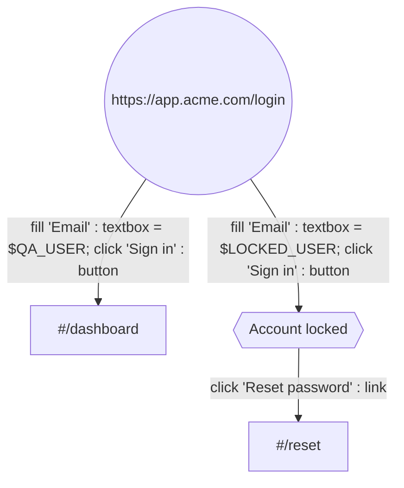
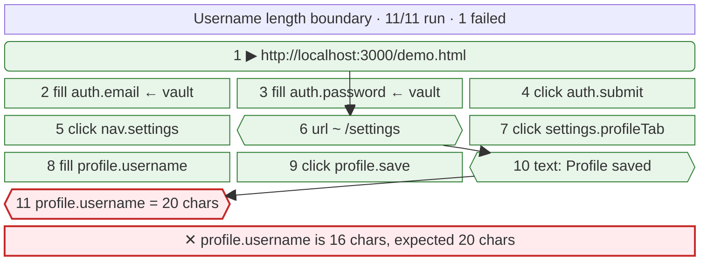

# ghostclick

A browser-automation PoC: a synthetic cursor visibly glides across a live
headless-Chrome feed and clicks things, driven by a small DSL — against any
allowlisted URL, with the script rendered as a mermaid diagram.

This repository is the **runner** and the **control plane**. The app is a
second repository, `poc-qa-stack`, and this one is *pointed at* its build
(`GC_WEB_DIR`) rather than building it — see [docs/BOUNDARY.md](docs/BOUNDARY.md).

**New here? [SETUP.md](SETUP.md) walks through it end to end** — both clones,
your own app, credentials, the extension, and a first recording.

```bash
npm install
npx playwright install chromium   # skip if your sandbox already ships one
GC_WEB_DIR=../poc-qa-stack/dist npm start

npm run check                     # end-to-end, against a running server
npm run check:freshness           # a UI deployed under a running runner is served, and re-stamped
npm run check:runner              # a command is never dropped, the lock always clears
npm run check:suites              # onboarding, the origin gate, suite runs
npm run check:recording           # repeated links, scrolling, jump-to-top, timeouts
npm run check:longnames           # paragraph-long names, casing, sticky anchors
npm run check:naming              # when the page and the browser disagree about an element
npm run check:redirects           # redirect chains, statuses, the friendly 404
npm run check:app                 # one command starts it all, each half handed its half of the keypair
npm run check:patience            # late vs never coming, and settling
npm run check:pace                # a fast run reaches the same verdict as a watched one
npm run check:console             # a late viewer is primed, the wheel reaches the page, the vault does not
npm run check:teach               # demonstrate by hand, then replay what it wrote
npm run check:fidelity            # does the replay reproduce it? would coordinates have?
npm run check:shared              # the picker, the hand-off, every copy of the language and its version
npm run check:auth                # forgeries refused, Python signs it, Node checks it
npm run check:boundary            # no bundler crept back, and the UI is still a directory
npm run check:diagram             # generated mermaid vs. the real parser
```

`GC_WEB_DIR` names a built UI — `poc-qa-stack`'s `dist/`, a CI artefact, a
read-only mount in a container. There is no default: one would name a path this
repository cannot produce, so it could only ever be a directory that is not
there, and that arrives as a 404 on the app's own address, which reads as a
broken deploy rather than as an unset variable. So absence is said instead: the
banner reports `NO UI` and `/app/` answers a sentence naming the variable.

```bash
bash run.sh                       # both repositories, one command ← the one you want
bash run.sh --open                # no sign-in at all, the one-laptop shape
npm run app -- --auth             # the same as run.sh, if you would rather call node
npm run app -- --fast             # runs skip the performance
npm start                         # the runner alone: refuses without GC_WEB_DIR
npm run serve                     # the server alone: happy with no UI, and says so
npm run check:all                 # every check, in one command
```

`bash run.sh` and `npm run app` find the UI checkout at `../poc-qa-stack`
(or `GC_UI_REPO`) and build it on every run, so cloning the two side by side
is the whole setup. A `GC_WEB_DIR` you set yourself always wins, and nothing is
built. `npm start` never builds anything and wants `GC_WEB_DIR`.

## Two services, one repository

`auth/` (the control plane) is a **separate project** that happens to live
here. It reads no file outside itself, nothing the runner loads reads a file
from it, and the two are joined by one signed token and one HTTP call. That is
what would make splitting it a `git filter-repo` too; `npm run check:boundary`
is what stops that quietly ceasing to be true — and it matters more than it did
for the UI, because the UI's half of the boundary is now held up by the
repository itself and this one is held up by nothing else.
See [docs/BOUNDARY.md](docs/BOUNDARY.md).

## Signing in, when you want to

There is no login by default, and that is the intended shape for one person on
one laptop. Give the runner a public key (`GC_AUTH_PUBLIC_KEYS`) and every
`/api` route and the WebSocket require a short-lived Ed25519-signed token
minted by the Django control plane in `auth/`, which alone holds the private
key (`GC_SIGNING_KEY`); the boot banner says which mode it is in, and which
keys it trusts, every time. `npm run app -- --auth` does all of this; by hand:

```bash
cd auth && python manage.py signing_key --new      # prints both lines below, once

# the control plane                                    # the runner
GC_SIGNING_KEY='…' python manage.py runserver 8000     GC_AUTH_PUBLIC_KEYS='{"<kid>": "…"}' GC_WEB_ORIGIN=http://localhost:3000 GC_AUTH_ORIGIN=http://localhost:8000 GC_WEB_DIR=../poc-qa-stack/dist npm start
# the UI, in the other repository
VITE_AUTH_URL=http://localhost:8000 npm run build
```

That last line is not a convenience — the address is baked into the bundle, so
a UI built without it has no login at all and nothing on this side can add one.
`npm run app -- --auth` reads the build it is given and says so before starting.

The runner cannot mint: it holds public keys and nothing else, refuses to
start if the old shared `GC_AUTH_SECRET` is still in its environment, and
opens a socket only for a thirty-second single-use ticket bought with the
token — never for a token in the URL. With auth on it also refuses to let the
driven page reach loopback, private or link-local addresses, stops serving
the bundled demo apps (`GC_DEMO=1` brings them back), and sends the security
headers docs/AUTH.md §11 lists on every response.

The origin allowlist and the vault stay entirely on the runner and are
re-checked there, so the control plane can neither add an origin nor read a
secret. Signing up, in and out, the verification code, the reset link and
the password and email changes are django-allauth's, reached by the UI over
JSON: sign-up is by invitation unless `GC_SIGNUP_MODE` says `open` or
`domain`, an address is proven by a six-digit code before it can do
anything, and Cloudflare Turnstile stands in front of open sign-up and of
any address that has tripped the failed-sign-in limit when a key is set.
With `GOOGLE_CLIENT_ID` and `GOOGLE_CLIENT_SECRET` set there is also
"Continue with Google": the same sign-up policy, one factor and not two, a
Google identity that opens an existing account only when both sides have
verified the address and nothing else already opens it, and one sentence
for every refusal.
A second factor — an authenticator app with recovery codes, or a passkey,
which also signs in on its own — is asked for after the password at every
sign-in once enrolled, and before every sensitive change: for an account
that holds one the password is never enough to change the password, the
address, the authenticators or the codes. Staff, the owners and admins of
an organisation, members of a plan that says so and accounts that sign in
only with Google must enrol one before the control plane lets them do
anything else, and `/admin/` sends staff to enrol first. Authenticator
secrets are encrypted at rest with `GC_MFA_KEY`, a key that is not
Django's. Every session the account has is listed under Security, with
where and when, and any of them can be ended from there.
Passwords are Argon2id-hashed, at least 15 characters, and checked against
Have I Been Pwned when set and again at every sign-in; every sign-in,
sign-out, refused password, refused code, sign-up, verification,
enrolment and change is a row in an audit log; a session ends after 12
idle hours or 7 days, whichever comes first, and a password change or
reset ends every session the account has.
Every account has a personal organisation, and organisations have owners,
admins and members, invitations (mailed to the invitee, and consumed the
moment the invited address is verified), and a plan that says what they may
do — the token the runner sees carries which organisation you are acting
for, your role and the plan's limits, and the runner enforces every one of
them itself (docs/AUTH.md §10):

- **State is per organisation.** The origin allowlist, the vault and run
  history live under `.ghostclick/<org>/`, suites under `suites/<org>/`,
  and a request only ever sees its own organisation's — another
  organisation's suite id is a 404, never a 403. With no login there is one
  organisation, `local`; a runner from before this rule moves its flat
  files under `local` once, at boot, and says so in the banner.
- **The plan is enforced by the runner, not the page.** `suites.max` when a
  suite is made, `runs.per_day` when a run starts (counted from that
  organisation's own history), `origins.max` when an origin is allowed,
  `vault.enabled` when a `$KEY` is resolved, `history.retention_days` when
  history is read. A refusal is `402 {error: "entitlement", limit, plan}`
  whoever asks — a bare `curl` gets the same answer as the UI, which draws
  it as an upgrade prompt rather than an error. A token minted before the
  plan changed is refused once a newer one has been seen.
- **One browser, one driving organisation.** Whoever opens a page or starts
  a run is driving; frames, the address, the targets and the page's console
  reach that organisation's sockets and nobody else's, and everyone else
  gets `409 {error: "runner_busy", org}` on every path to the browser until
  the run has ended and the driver has been quiet for a minute
  (`GC_RUNNER_IDLE_MS`). The UI shows who is driving instead of a black
  canvas.
- **Origins and the vault are an owner's or admin's to change**; members run
  and view. The organisation's members, roles, invitations, plan and usage
  are under **Organisation** in the sidebar, which also switches between the
  organisations you belong to.

See [auth/README.md](auth/README.md), and [docs/AUTH.md](docs/AUTH.md).

On a laptop the control plane's mail is printed to the terminal `npm run app
-- --auth` runs in, codes and links included; `bash scripts/adduser.sh
you@example.com` makes an account whose address counts as verified, and
`GC_SIGNUP_MODE=open npm run app -- --auth` lets you sign up through the
page instead. `GOOGLE_CLIENT_ID=… GOOGLE_CLIENT_SECRET=… npm run app --
--auth` adds the Google button, for a client whose redirect URI is
`http://localhost:8000/accounts/google/login/callback/`.

The recorder extension is handed a token the same way, by its background
worker with your session, when its `chrome-extension://<id>` is listed in
`GC_EXTENSION_ORIGINS` on both services (the panel shows the id); nothing
else can post a recording to a gated runner.

Deployed, the same three services sit behind one Caddy on one URL
(`PUBLIC_URL`), from which every host, origin and cookie rule is derived, with
the runner on a network of its own that has no route to the control plane or
its stores,
a scheduler that clears sessions and the audit log, hashed and digest-pinned
dependencies, and a root-owned key file that the deploy user reaches only
through `sudo`. See [docs/DEPLOY.md](docs/DEPLOY.md).

It prints what it is running, and the sidebar shows the same thing:

```
  ui          ->  rebuilt (built in 880ms)
  version     ->  0b8c46a, ui built 2026-09-06 16:43
```

If that commit is not the one you expect, you are looking at an old UI — which
is worth knowing before spending an afternoon on a bug you already fixed.

The console starts empty on a first run — the runner opens whatever you ran
last, and a fresh clone has no history yet. Paste a URL, or run one of the
suites below.

Two bundled apps to drive. **Meridian** silently truncates a username to 16
characters while showing a success toast. **Nimbus** shows `Widget × 2` in the
cart and charges for one. Both bugs turn their run red.

---

## How it works

The whole pipeline, editable: [`docs/ghostclick-end-to-end.drawio`](docs/ghostclick-end-to-end.drawio)
— open it at [app.diagrams.net](https://app.diagrams.net) or with the draw.io
VS Code extension. The map of the parts as they are built — every module, store,
route and event, and how they talk — is [docs/ARCHITECTURE.md](docs/ARCHITECTURE.md).


Three loops share one Chrome. Video flows right-to-left, control flows
left-to-right, and they meet only inside `VirtualCursor`. The IR forks: the
same data structure the executor walks is what gets drawn.

```
   LOOP 1 — video                        LOOP 2 — control

   Chrome                                viewer <textarea>
     │ Page.screencastFrame                    │ WS {t:'command', text}
     ▼                                         ▼
   node: ACK, cache lastFrame              parse.js   text → IR
     │ WS binary (JPEG)                         │
     ▼                                         ▼
   canvas.drawImage()                      validate() ← origin allowlist
                                               │        + target grammar
                                               ├──────────────┐
                                               ▼              ▼   LOOP 3 — picture
                                           executor       diagram.js
                                               │              │ IR → block-beta
                                               ▼              ▼ WS {t:'diagram'}
                                        VirtualCursor    mermaid.render()
                                          (owns x,y)
                                               │
                            ┌──────────────────┴──────────────────┐
                            ▼                                     ▼
              CDP Input.dispatchMouseEvent            WS {t:'cursor'|'press'}
                            │                                     │
                            ▼                                     ▼
                   Chrome really moves                 <svg> arrow moves
                                                       (delayed by LAG)
```

The fork at the bottom is the core design. One object owns the pointer
position; every move injects a real event into Chrome **and** emits a draw
event to the overlay in the same tick. `click()` takes no coordinates — it
fires wherever the cursor already is — so the drawn arrow and the injected
click cannot disagree about where they are.

The fork in the middle is why the diagram can't lie either: `diagram.js` is a
pure function of the same IR, run twice — once before execution as a plan, once
after with outcomes folded in as a report.

### One click, in time

```
 t=0      executor : pointAt('button:Sign in') → waitFor → boundingBox → (373,434)
 t=0..420 cursor   : ~26 × moveTo() ─┬─ CDP mouseMoved       ──▶ Chrome
                                     └─ WS {t:'cursor',x,y}  ──▶ viewer (draws at t+LAG)
 t=420    cursor   : re-read the box; correct if the page reflowed mid-glide
 t=560    cursor   : click() ─┬─ WS {t:'press'} ──▶ ripple at t+LAG
                              ├─ CDP mousePressed
                              │   └ 70ms hold — a press with no duration is
                              │     invisible on a 10fps feed
                              └─ CDP mouseReleased
 t=630+   Chrome   : repaints → screencastFrame → ack → viewer canvas
```

---

## Where the script actually runs

This is the thing that trips everyone up once, so: **Run script does not touch
your mouse, or your tabs, or the page you are reading.**

It drives a *separate* browser that ghostclick launched, and streams a video of
that browser onto the canvas. The arrow gliding across the canvas is drawn over
that video. Your own cursor never moves, because it is not involved.

```
your screen                          the browser being driven
┌──────────────────────────────┐     ┌─────────────────────────┐
│ the viewer, in your browser   │     │  a second browser,       │
│                               │     │  launched by the server  │
│   canvas  ◀── video ──────────┼─────┤                          │
│   arrow   ◀── coordinates ────┼─────┤  ← the clicks land here  │
│                               │     │                          │
│   your real mouse: untouched  │     └─────────────────────────┘
└──────────────────────────────┘
```

That separation is the point. It means a run behaves the same on your laptop, on
a server, and in CI, and it means you can keep working while a suite runs.

**If nothing appears to happen when you press Run**, look at the canvas, not at
your own page. The status bar under it says what is going on, and says why if a
run failed.

### Watching it in a real window

If a video of a browser is not convincing, open a real one:

```bash
HEADED=1 npm start
```

A Chrome window appears and gets driven in front of you — same automation, same
canvas feed, just visible in a browser you recognise. Worth doing once. Leave it
off for anything unattended, since a headless browser is what makes a run work
on a server with no screen.

The banner says which mode you are in:

```
  browser     ->  headed — a real window you can watch
```

### What it deliberately will not do

It will not take over your operating system's cursor. That is a different kind
of tool — it would fight you for the machine, break the moment you moved the
mouse, and could not run anywhere without a screen. Everything here works
through the browser rather than around it.

### Cloudflare Turnstile

It will not get past a Turnstile challenge either. Turnstile exists to tell a
person from an automated browser, and the browser a run drives is an automated
one — so a sign-up behind a production key fails with "Verification failed",
and the step that notices is usually an assertion a few steps later.

So the runner says so. When a Turnstile widget loads on the page being driven,
the log names its key, and a step that fails on that page carries the reason
(turnstile.js):

```
  Cloudflare Turnstile is on this page with a production key, which stops automated browsers — if this step needed to get past it, that is why.
```

What makes such a form testable is Cloudflare's own test keys, set in the
environment the suite points at — a staging or preview deployment, never
production:

| Site key (in the page) | Secret (on the backend) | Turnstile |
|---|---|---|
| `1x00000000000000000000AA` | `1x0000000000000000000000000000000AA` | always passes |
| `2x00000000000000000000AB` | `2x0000000000000000000000000000000AA` | always fails |

The widget still loads and the backend still verifies the token, so both halves
of the form are tested for real. Change both together: a production secret
rejects the dummy token a test key hands out. Production keys come from the
Cloudflare dashboard's Turnstile page, one widget per environment.
`npm run check:turnstile` drives a real widget on both test keys.

To see the whole flow end to end, demo mode serves a sign-up behind Turnstile at
`/turnstile-demo/` — the shape a real one has, made runnable. Drive it and the
widget renders from `challenges.cloudflare.com`, its token is POSTed to
`/turnstile-demo/verify`, and the server checks it against Cloudflare's
`siteverify` exactly as a site's own backend would — then lands on "Account
created". It runs on the always-pass pair by default, so it reaches that page
every time, from anywhere, no proxy — which is the point of test keys: the
verdict no longer depends on the browser or the IP. Set `GC_TURNSTILE_SITE_KEY`
and `GC_TURNSTILE_SECRET` to the fail pair above and the same page shows the
"Verification failed" a production key gives you. This is the reference for what
a treasury.sh **staging** environment should be: its own sitekey and secret
pointed at the test pair, and its Turnstile stops being a wall for the suite —
while production keeps its real keys and its real protection.

### A saved sign-in, for a login that can't be recorded

Some logins cannot be recorded and replayed at all. "Continue with Google"
refuses to run in an automated browser — Google blocks sign-in from a browser
"controlled through software automation rather than a human" — and a passkey or
an emailed code is no better. The flow worth testing is everything *past* the
login, and re-doing the login on every run is the one part that cannot happen
here.

So a person signs in **once, in their own browser**, and the recorder extension
hands the runner the session that login produced — the cookies the app set for
itself, never anything Google holds. The runner opens its browser already
carrying them, and a run starts on the signed-in page. This is Playwright's own
`storageState`, and reusing a saved sign-in is what its docs recommend for
authenticated tests (sessions.js). No terminal:

1. **Allow the app's origin** in ghostclick (Origins & vault), once — the same
   decision every origin needs.
2. **Sign in to the app in your own browser**, exactly as you always do — Google
   included, because here you are a person and it is allowed.
3. Open the **ghostclick recorder extension** and press **Save my session for
   this site**. It reads that site's cookies — which a web page cannot — and
   posts them to the runner over the same token hand-off the recorder uses.
4. The **Console** now shows **Opens signed in for `<site>`**, with when it
   expires and a **Clear** button. The site opens already signed in.

Use a test account, never your own — a session is a live login.

By hand, without the extension, `npm run session -- import <storageState.json>`
loads a session file (`--org <slug>` with a login; `status` and `clear` too);
produce the file with `npx playwright open --save-storage=…` for a login that
runs in a Playwright browser — but "Continue with Google" is blocked even there,
which is exactly why the everyday-browser extension path exists.

A saved sign-in is a live credential, and it is treated like the vault:

- **One per organisation**, under `.ghostclick/<org>/session.json`, gitignored —
  the one file in there worth guarding like a password.
- **Only ever loaded for an origin you still allow.** A cookie is a key to a
  host; the allowlist is checked when the session is saved *and* again every time
  it is loaded, so an origin removed in between is dropped, not replayed.
- **Never disclosed.** The value goes to no viewer, and the session cookie is
  redacted out of the driven page's console the way a vault value is.

With auth on it is also an owner's or admin's to set, from a recent sign-in, and
the extension can post one to `POST /api/session`. `npm run check:sessions`
proves the whole path against a cookie-gated fixture: a session captured from a
signed-in browser opens a fresh one already signed in, the allowlist gates it
both ways, and the cookie is redacted.

Two related paths this does **not** build, for the record: a **passkey** login
can be driven directly through Chrome's virtual authenticator (a CDP
`WebAuthn` domain the runner already has a session for), and a staging
environment can point "Continue with Google" at a **mock OIDC server**
(navikt/mock-oauth2-server) so the button itself is exercised. Both are
legitimate; neither is here yet.

## Test suites — how a project gets in

### The fast way: one URL

Paste your app's URL on the Test suites screen and press **Add and test**. It
opens the page, names the suite from its title, reads what is on it, asserts you
reached it, and runs that — so you find out whether the runner can drive your app
at all before deciding how much to invest.

It asserts only the URL. Guessing which of a page's words are stable enough to
assert would produce a suite that fails for reasons nobody chose, so the text
expectations stay a human decision, one screen away.

The gate is not skipped: a URL nobody has approved comes back naming the origin
it needs, and the same panel becomes the button that approves it.

Scanning also reads the same-origin links on the page, so the app's own nav
becomes a row of one-click **+ Billing `/#/billing`** buttons. Onboarding a real
multi-page app is clicking its navigation, not typing its routes.

### The thorough way: four questions

A suite is the onboarding unit. Not a folder of scripts: the answer to four
questions, asked in the order that makes each one answerable.

| Step | What you give it | What it buys you |
|---|---|---|
| **Project** | a name and one base URL | the origin is decided once, in front of a person |
| **Pages** | the discrete URLs worth visiting | a **scan** opens each in the runner and reads its accessibility tree |
| **Expectations** | ticks over what the scan found | assertions that survive a markup change, because they came from the same model `getByRole` queries |
| **Cases** | recorded or written flows | the suite runs |

A suite covers **one origin**, and every page is a path beneath it. That is not
tidiness — it means adding a page later can never walk the runner to a host
nobody approved. The origin decision happens once and the suite cannot widen it
afterwards.

Creating a suite does **not** allow its origin. Onboarding asks for that
separately, with a button, because allowing an origin is a human act and always
has been. A generated plan cannot reach it; neither can the wizard.

Nothing unrunnable is ever stored. Every case is parsed and validated on the way
in with the same function the executor uses, so a case that cannot run is
refused at save rather than discovered at 2am:

```
POST /api/suites/x/cases  {"flow": "testcase TD\n a((\"https://evil.example.com/\"))"}
→ 400  Step 0: origin https://evil.example.com is not allowed yet
```

The payoff of onboarding is that the suite tests something before anyone records
a click. Each page's expectations generate a case — reach it, assert what should
be there — and that is the test that catches "the URL moved" instead of leaving
it as a mystery three steps into a longer flow.

Suites live in `suites/<org>/*.json`, **in the repository**, one readable file
each — `suites/local/` on a laptop with no login, one directory per
organisation with one. Run history is machine-local (`.ghostclick/<org>/`,
gitignored) because it records what happened on your machine; a suite is the
opposite — the shared description of a project, so it should diff, review and
merge like any other source file.

---

## Teach mode

Press **Record**, then click and type on the feed. Canvas input goes through the
same `VirtualCursor` the executor drives, so it reaches Chrome as genuine DOM
events — which means one injected capture-phase listener sees a human
demonstrating exactly as it would see the executor replaying. Recording is gated
off during a run so the two never feed each other.

What comes back is the script:

```
%% suite "Recorded flow"
testcase TD
  n0(("http://localhost:3000/demo.html"))
  n1["/demo.html#/dashboard"]
  n2["/demo.html#/settings"]

  n0 -->|fill 'Email' : label = 'qa@example.com'; click 'Sign in' : button| n1
  n1 -->|click 'Settings' : link| n2
```

Two things make it trustworthy rather than merely clever.

**The page proposes; the server decides.** For each interaction the page offers
several candidate targets, most stable first — `testid:`, `label:`, `role:name`,
`placeholder:`, `text:`. Each is resolved with the same locator the executor will
use and kept only if it matches exactly one element, and that element is the one
interacted with. A recorder that emits targets it has not proved is how you get a
suite that passes on the machine that recorded it and nowhere else.

**A typed password never leaves the page.** A `type=password` field records as
`$TODO`, which fails loudly on replay until someone maps it to a vault key. The
value is dropped in the browser, so it is never in the socket, the log, or the
script.

`npm run check:teach` drives the canvas the way a human would, then replays the
result and asserts the typed password is nowhere in it.

## Recording somewhere you can't reach

Teach mode only records apps ghostclick's own browser can open. An app behind
SSO, a VPN, or a real login is a wall — your Chrome is already through it. So
`extension/` is a Chrome extension that records there instead.

Load it from `chrome://extensions` (Developer mode → Load unpacked), open the
app, and click the toolbar icon. Then:

```
Pick element   →  the next click is HELD, not delivered
panel asks     →  Click it / Type into it / Assert text visible
you answer     →  the step is written, and the click is replayed for real
```

Pick, annotate, then perform — in that order. Arm the picker, click a sidebar
link without suppressing it, and the page navigates away while the panel is
still asking about a button that no longer exists.

**Send to ghostclick** posts the flow to `/api/recording`, which validates it
through the same gate as everything else and drops it in the script box. It is
never run automatically: any page you visit can reach a localhost port, so an
endpoint that executed what it was handed would be a remote-code path with
extra steps. With a login, the extension's background worker first asks the
control plane for an executor token on the strength of your session — which
it is given only when its origin is listed in `GC_EXTENSION_ORIGINS` — and
presents that; see `extension/README.md`.

`extension/lib/propose.js` — how an element gets named — is read off disk and
injected by the server's teach mode as well, so the extension and the runner
cannot disagree about what a target means. `npm run check:shared` asserts
that, drives the picker against a real page, and loads the extension in Chrome.

See `extension/README.md` for the rest, including why replaying a login needs
either the login recorded or a session you have chosen to export.

## “Why doesn’t it just replay my coordinates?”

It records them — every click carries where the pointer actually was, and the
box it landed in, as `%% at` comments that round-trip through the language. It
just doesn’t *navigate* by them.

`npm run check:fidelity` settles both halves of this by running them:

```
— 1 · demonstrate by hand, then replay what it wrote
  demonstrated  http://localhost:3000/demo.html#/settings
  replayed      http://localhost:3000/demo.html#/settings
  same page after both  ✓
  no drift — every element resolved where it was clicked

— 2 · would replaying the coordinates have worked?
  same page, window 880 wide instead of 1180:
    coordinate 353,371 now lands on   div#login  (the Sign in button? NO)
    button:Sign in still resolves                yes, exactly one
```

Part 1 demonstrates a login by hand, replays the recording from a clean start,
and compares the two end states — same URL, same accessible tree. Part 2 takes
the recorded coordinate for the Sign in button and asks what is there in a
narrower window. Nothing useful: the layout is centred, so the point that was
the button is now the `<div>` behind it. The name still finds it.

That is the whole reason record-and-replay tools built on coordinates have the
reputation they do. A window a hundred pixels narrower, a scrollbar, a cookie
banner, a different DPI, one extra row in a table — any of those moves the pixel
without moving the button.

So the coordinates are kept as **evidence**, not as the mechanism. On replay
each one is compared with where the element actually resolved, and a step that
lands somewhere else says so:

```
button:Sign in: recorded at 353,371 but resolves to 812,540 — 471px away.
Fine if the layout moved; suspicious if it did not.
```

That is the case coordinates genuinely catch and a name cannot: a target that
resolves cleanly to exactly one element — the wrong one.

### “Live — run failed”, with no reason

Two things used to make that unhelpful, and both are fixed.

The status bar now carries the first line of whatever broke, and the full text
is in its tooltip and the run log.

And the most common failure now names itself. If you press **Record** while
already deep in the app — logged in, three screens down — the recording's entry
URL is wherever you happened to be. In a single-page app the path is usually
decorative: pushed with `history.pushState`, never read on load. So replaying
`/app#/settings` hands the runner the **login screen**, and the first step waits
eight seconds for a field that was never going to appear.

Recording now fingerprints what the entry page offered, and replay checks it
before doing anything else:

```
✕ step 0 — This recording starts part-way through a session.
  http://localhost:3000/demo.html#/settings loads a different page than the one
  it was recorded on — 1 of 4 expected elements are here.
    expected: link:Settings, button:General, button:Profile, textbox:Time zone
    found:    link:Settings, textbox:Email, textbox:Password, button:Sign in
  Record again from a URL that reaches this screen on its own — usually the
  login — so the flow can get itself back here.
```

**Start recording from a URL that stands on its own.** Usually the login page.
Record the sign-in as part of the flow; that is what makes it repeatable on a
machine that has never seen your session.

### A menu that is only there while you point at it

The most common way a recording of a real site fails. A dropdown's items do not
exist in the page until the pointer is on whatever opens them, so a script that
only clicks waits eight seconds for a menu nobody opened:

```
✕ click menuitem:Catch harmful AI answers …
  locator.waitFor: Timeout 8000ms exceeded
```

Three things now deal with it.

**The recorder notices.** It keeps a baseline of what is on the page when the
pointer is *not* provoking anything, and a short trail of what the pointer has
been over. A click on something that was not in the baseline was revealed by the
pointer, so the last thing it was over that *was* already there gets recorded as
a `hover` first — without anyone having to know to add it:

```
n0 -->|hover 'Use Cases' : link; click 'Catch harmful answers …' : menuitem| n1
```

The baseline is only refreshed while nothing is hovered. Sampling on a plain
timer was wrong: pause on an open menu for longer than the interval and the open
menu becomes the baseline, so the click that follows looks like it was always
available.

**The cursor approaches instead of lunging.** It used to glide straight from the
trigger to the item, which cuts the corner and leaves the region keeping the menu
open — the menu shut mid-glide and the runner waited for an element that had
stopped existing. It now enters the target's box at the point nearest the cursor
and then settles to the aim point: two short legs that stay inside.

**And `hover` is an op you can write by hand**, in the flow language and in the
extension's picker (**Hover it**), for the cases nothing infers.

**When a target still cannot be found**, the failure names what the page does
have, which is usually the answer:

```
"menuitem:Catch harmful answers …" never became visible.
  The page does have: link:Catch harmful AI answers.
  If yours lives in a menu, put a hover step before it:
    home -->|hover 'Use Cases' : link; click '…' : menuitem| home
```

Often the plain `link:` version is the better target anyway — it does not depend
on a menu being open.

### What a recording still does not capture

Being straight about the edges, because this is where “it didn’t run what I did”
turns out to be true:

- **Scroll position.** Steps scroll their own element into view; a scroll you did
  for its own sake is not a step.
- **Drag, and anything mid-gesture.**
- **Keyboard-only navigation** — tabbing to a control and pressing Enter records
  as nothing, because no element was clicked.
- **Where inside an element you clicked.** Replay aims at the centre. It matters
  for a canvas, a map, or a slider; nowhere else.
- **Your timing.** Waits are re-derived from what the page does, not from how
  long you took.

Each of those is a real gap, not a subtlety. If your flow needs one, say so and
it becomes an op.

## The runner starts where you left off

It used to start on `demo.html`, the bundled demo app, every time. That is a
reasonable thing to see once and a strange thing to be shown on the fortieth
launch, when what you were actually working on was a staging URL.

It starts on the last site you ran now, read out of run history — `HOME_URL`
still wins if you set one, and if there is neither it opens nothing and the
console says "Nothing open yet" instead of showing a black rectangle and the
word "waiting", which reads as a hang.

The remembered URL still has to pass the origin gate. It is a URL that ran here
before, so it normally does — but an origin you have since removed should not be
re-opened just because a file remembers it. Verified by running against a second
origin, revoking it, and restarting: the boot skipped that newest entry and fell
back to the one before it.

The URL box no longer suggests `demo.html` either, and it has an accessible name
now — the checks were finding it by its placeholder text, which is a fragile way
to find a control and left it unlabelled for anyone using a screen reader.

The rule lives in `home.js` and is pure — no fs, no network, no browser —
because the version inside `server.js` could not be tested without starting a
browser and binding a port, and the branch that mattered most was therefore
never executed anywhere. Run history is gitignored, so **every machine that had
ever run the suite took the first branch and no machine ever took the last
one**: on a fresh clone or a CI runner the browser stays on `about:blank`, and
three things broke there that the green suite could not see.

`check:startup` covers the decision against fabricated input — including the
empty-history case this machine cannot produce — and then starts a real server
on its own port and reads its boot banner, which prints the choice before
navigating. Both halves are needed: the first alone would pass while
`server.js` ignored the function entirely, and the second alone can only test
whatever state the machine happens to be in. It drives one case against a
different page first, so the rule's answer can never coincide with the demo
that a reverted server would open.

What a null home broke, now fixed: `check-console`'s first two sections
asserted on a painted canvas before opening anything, so they were testing
yesterday's history rather than the product; `entryUrl()` returned the string
`'about:blank'`, which is truthy, so pressing Record before opening anything
produced a case whose step 0 was `goto "about:blank"` — refused by the origin
gate forever, unsaveable and unrunnable; and the URL box pre-filled with it, so
Open answered `Only http and https can be driven, not about:`.

`about:blank` also *paints* — a blank white frame is still a frame — so the
"Nothing open yet" state has to be checked before `painted`, or it never
appears and you get an unexplained white rectangle instead of the black one it
replaced.

## Defects: numbered, filed by the runner, triaged by people

Run history answers "what happened". Defects answers "what is broken", and gives
each answer a number you can say out loud and paste into a ticket.

**The number is `DEF-YYMM-NNN`.** `DEF-2609-007` is the seventh distinct failure
first seen in September 2026 (UTC). The counter starts again at 001 each month,
grows past three digits rather than wrapping, and a number is never handed out
twice — not after a restart, and not after the defect it named has been
forgotten. It is found however it is typed: `def-2609-7`, `2609-007` and
`#2609-7` all mean `DEF-2609-007`.

**Nobody files a defect.** A run records only its first failure, because a run
stops there, so a defect is that sentence, about the step that failed, on the
site it happened on. Grouping by what failed rather than by the case is the
point: one broken selector takes down four cases, and four rows saying the same
thing is a list, not a diagnosis. The step is part of it because a sentence is
not always about anything — Playwright says `locator.waitFor: Timeout 8000ms
exceeded.` of every wait that runs out, and a missing receipt and a missing
price are two defects. How long something waited is not part of it: "…in the
10.5s this waited" and "…10.4s…" are one defect. (Runs recorded before a run
named its step have no step to match on; the first run that does, with the same
sentence on the same site, takes their defect over, number and all.) After every
run, the runner:

- **files** a failure it has not seen before, under the next number;
- **closes** every open defect whose case has just passed;
- **reopens** a closed defect that fails again, under the same number.

Each lands in the defect's activity as ghostclick's, and in the console log as it
happens (`DEF-2609-007 filed: …`). The reporter is always the application.

**Severity is worked out, and a person can overrule it.** Critical when the case
could not get past its first step, or three or more cases went down with it;
major when two did, or when it came back after being fixed; minor otherwise.
Trivial is only ever a person's call.

**People triage.** An owner or admin can assign a defect, overrule its severity,
or park it as a **known issue** or **won't fix** — the only fields a person
writes, each recorded with who changed it. A parked defect that starts passing is
closed like any other, so if it comes back it comes back *reopened*, for someone
to look at again, rather than hidden under an old "won't fix".

A status is the first of these that is true: `closed` (passing again),
`known_issue`, `wont_fix`, `reopened`, `open`.

| Route | |
|---|---|
| `GET /api/defects` | every defect kept, and how many are in each status |
| `GET /api/defects/:id` | one defect by any spelling of its number, with its activity and the failed runs history still holds |
| `PATCH /api/defects/:id` | `{assignee, severity, resolution}`, owners and admins only; `null` gives a field back to the runner, and anything else is a 400 that changes nothing |

`GET /api/runs` names each failed run's defect as `defect`, so a history table
can link to the number.

The registry is `.ghostclick/<org>/defects.json`, beside the history it is read
out of, and is brought up to date from that history after every run and before
every read. Closed defects are forgotten on the plan's `history.retention_days`,
like runs; an open one is kept however old it is. `npm run check:defects` holds
all of the above to account, the routes included.

## Hero images

Drop `.jpg`, `.png`, `.webp` or `.avif` files into `public/hero/` and the hero
panels use them as a backdrop. An empty folder is the normal case and you get
the gradient. The list is read per request, so adding files needs a reload and
not a restart.

Each page picks one deterministically from the sorted list, so a page keeps the
same picture across reloads and two pages do not show the same one — a hero that
reshuffles on every navigation reads as a page that has not finished loading.

**The scrim is not decoration.** Putting arbitrary photographs behind near-black
text is how a page becomes unreadable on the one image nobody checked, so the
text sits on a band of solid panel colour that fades into the picture and even
the far edge keeps 45% panel over it. Legibility does not depend on which image
you chose, which matters when the folder is filled by whoever is using the tool
rather than by a designer.

## The console of the page you are driving

A step fails with `expected the URL to contain "/dashboard"`, and the reason is
usually something the page already printed — an uncaught TypeError, a 500 its
fetch wrapper logged. That reason lived inside a browser nobody could open
devtools on.

Everything the driven page prints is forwarded now: every `console.*` level,
plus `pageerror`, which never reaches `console.*` and is the one you most often
want. It sits under the script, folded away behind a toggle with an error count
on the header, because an app that logs on every render would otherwise be the
whole screen. Consecutive duplicates fold to one line with a count, the same as
the run log.

**Vault values are redacted on the way out.** A fetch wrapper printing the token
it just sent is not a rare mistake, and a secret that never leaves the server
must not leave it through here either — so a match on any vault value is
replaced with its name:

```
auth: sending token $QA_PASS to /api/session
```

`public/noisy.html` is a page shaped like an app mid-incident — every level, one
line repeated five times the way a render loop repeats it, the bundled demo
credential printed the way a hurried wrapper prints it, then a throw.
`check:console` section 6 drives it. Removing the redaction turns that check red
with `THE SECRET IS ON SCREEN` — the redaction happens in the runner, before
anything can render it, so that assertion stayed here when the rest of the old
console check went to poc-qa-stack with the components it was reading.

The ↑ Top / ↓ Bottom buttons are gone. The wheel is the way you scroll a page,
and the buttons were a workaround from before it worked. The `scroll to top` and
`scroll to bottom` verbs in the language are untouched — a script still needs to
say "go to the footer" — but the socket op the buttons used went with them
rather than being left unreachable.

## Agentic monitoring: watch an element, in plain English

A run says whether a script still passes. It says nothing about the paragraph
that quietly grew to 36px on Tuesday, the table that lost a row, the submit
button a CSS deploy hid — none of which any step clicks on. **Agentic
monitoring**, the sidebar item under Console, watches those.

Pick an element on the page the way DevTools' inspector does — hover the
canvas, the element under the pointer is outlined *inside the video*, click it
— and describe in plain English what must stay true about it:

```
font size must not exceed 18px
must keep exactly 5 rows
must always be visible
text must not change
width and height must not change
```

While you pick, the panel names what the crosshair is over — the outline is
drawn inside a JPEG frame, the words are beside it — and a click inside an
embedded frame, which the picker cannot see, says so rather than nothing. A
pick shows what was chosen: a clip of it, its words, its measurements, and
the script already written — `Must exist and always be visible; width and
height must not change; text must not change` (a table keeps its rows instead
of its size) — with the checks that sentence compiles to shown under it as you
edit it (`POST /api/monitors/preview`: the mock compiler, nothing kept) and,
under those, one chip per clause saying what became of it: understood (the
checks it turned into), **judged on change** (it cannot be a number; see
below) or **not understood**. Where the element sits is shown too
(`body › main › div.hero`). When the runner has a key, **Compile with Claude**
asks the model for its reading of the same sentence before you save
(`POST /api/monitors/compile`: one call from the daily budget, nothing kept),
so what you approve is what will run.

The rule is compiled ONCE into checks (`monitor-rules.js`): the mock compiler
instantly, from the phrasing above, and Claude — when `ANTHROPIC_API_KEY` is
set — asynchronously, replacing the mock's checks when its answer lands and
saying so on the socket (`monitor.compiled`) and on the card. Both compilers
are handed a bounded excerpt of the element's markup — its own HTML with
scripts, handlers and long attribute values taken out in the page
(`monitor/page/sanitize.js`), where it sits, and a line per sibling and child —
so "rows" binds to table rows or list items as the case is and "the price" to
the child that carries it; the excerpt is page content, redacted through the
vault and inside the untrusted block like everything else the model reads.
Every clause is accounted for: one that cannot be a number ("the call to
action must stay the most prominent element") becomes a **judgment clause** —
its proxies, the markup among them, say only that the element changed, and
Claude decides whether the rule still holds (below). From then on the model is
out of the loop for checks. An agent inside the page
(`monitor/page/`, installed the way the recorder is) watches the element with a
`ResizeObserver` and a `MutationObserver` and reports a snapshot when its
change signature changes; the runner evaluates every report by arithmetic
(`monitor-evaluate.js`), and a new state has to be CONFIRMED — by a second
report that agrees, or by a fresh measurement half a second later — before an
incident opens. That is what stops an animation frame becoming an alert, and
it is why an incident opens within about a second of the change and never for
a ticker that never stops.

An incident carries the evidence: before/after screenshot clips, the metric
diff (`fontSize: 16 → 36`), the failed checks with their numbers, and a
verdict — the mock's at once, Claude's a little later when there is a key
(severity and an explanation, from both clips and the markup before and
after). A change on a judgment clause opens the incident as **judging**
instead: Claude is asked, with the clause, both excerpts and both clips,
whether the rule as the engineer meant it still holds — one question per
monitor per minute, from the daily budget. A yes makes the incident stand, in
Claude's words; a no resolves it and the element as it is now becomes the
baseline, so the same state is not asked about again; no answer, no key or no
budget leaves it open, saying why — never silence. `npm run
check:monitoring-judge` drives that with a scripted model. When the
page recovers, the incident resolves itself. **Resolve & accept current state**
closes one by hand: relative rules take the element as it is now for their
new baseline; an absolute rule that still fails puts the monitor into
`acknowledged`, which stays quiet until the element changes again. Deleting a
monitor takes its incidents and their clips with it: the page reports on what
is set, not on what used to be.

A monitor belongs to a project. Open monitoring from a suite — its
**Monitoring** section in the sidebar, or the button on its Overview — and
the page opens on the suite's first page, its other pages are one click away
under the address, and every monitor made there carries the suite's id; on
the general page the project is picked in the address row. A monitor made
with no project belongs to the suite whose origin its page is on. The suite's
Overview counts its monitors and lists the issues found, and
`GET /api/monitors?suite=` and `GET /api/incidents?suite=` are the same line
drawn over the API.

Monitors are the organisation's, in `.ghostclick/<org>/monitors.json` and
`monitor-shots/`, and every monitoring event goes to that organisation's
sockets whoever is driving. They re-arm through the agent's own handshake
whenever their page is open — after a reload, after a run navigated away and
back, after the browser changed hands. A monitor whose page is not the one on
the browser is "not on this page", never "missing". Picking is refused while a
run or a recording holds the page, because the picker swallows clicks;
monitoring itself keeps watching during a run, which is rather the point.

Every time the page is opened again — a run's `goto`, Open, a reload, **Check
now** on the card — the new document arms its monitors and each is measured
against its rule at once. The card counts those visits and says when the last
was, and the log says `/pricing opened: checking Hero copy`. An element that
is not there when the document arms is late before it is missing: a freshly
armed monitor gives it six seconds (`ARM_GRACE_MS`) to arrive before a missing
incident opens, where a change on a page that has been open a while is
confirmed in half a second, as before.

Two things worth knowing about the security model. A monitor's selector is data
handed to `querySelector` inside a script the RUNNER installs; the flow
language still has no evaluate and no selector, and the page never gets a way
to run code. And the text a snapshot carries is page content: it is redacted
against the organisation's vault before it is kept, sent to a socket, or shown
to a model — whose prompt says, in so many words, that page content is
evidence and never instruction.

`public/monitor.html` is a page shaped to be watched, with a panel of real
buttons that break it (`Grow text`, `Remove table row`, `Hide submit`, `Reset
all`). `npm run check:monitoring` starts a runner of its own in mock mode and
drives the whole story through the API and the socket — including picking
from the canvas, and a click that must NOT reach the page. `npm run
check:monitoring-request` pins, offline, exactly what the resolver puts on the
wire. `GC_MONITOR_LLM` and `GC_MONITOR_AI_MAX_PER_DAY` are in `.env.prod.example`.

## Help, and a person, on every page

The top bar of every page has two buttons that are the bar's rather than a
page's, because the question arrives on whichever page you were on. **Help**
opens a panel over the page — the questions people ask first, links to the
written documentation (new tab), and how to reach a person — and closes with
Escape or the scrim. **Support** is the tiny one beside it: a topic and a
message, sent to the runner. Sending does one more thing, said in so many words
under the form: it turns on **support access** for your organisation, a flag
whoever operates the runner reads from `GET /api/support` and sees printed as
the request lands, so they know you are happy to be looked at. The pill then
reads "Support enabled", and the same sheet turns it off. The flag is a
statement, not a token — nothing in the runner reads it to allow anything;
wiring it to a ticketing or remote-assistance service is where a deployment
plugs in. Requests live in `.ghostclick/<org>/support.json` (`support.js`);
`npm run check:support` drives the round trip.

Three smaller things moved with this. Light, dark or the device's theme is a
setting, so it lives on *Origins & vault → Appearance* rather than in the
sidebar; the sidebar's collapse control is at the top, where a hand goes
looking for it, and Sign out is at the foot; and Run history's suite filter sits
with the tables it narrows instead of in the top bar.

## Chat: ask the runner what it knows

Under *General* in the sidebar there is **Chat**. It answers from the
organisation's own records — how many defects are open and which, what the
latest runs and scans were, which suites, pages and cases are saved, what the
monitors are watching, whether the runner is busy — and it can act on them:
"can you test the contact us page" finds the saved case that best matches,
runs it, and reports the result with a run card, the failing step and the
defect number if one was filed. When no case matches it says so and offers
what the runner can do instead — run the page's expectations as a one-off
check, or quickstart a suite from a URL.

It is not a vector index. Everything it can say is already a small,
structured, live store this process keeps per organisation (`runs.js`,
`defects.js`, `suites.js`, `monitor.js`), sized in hundreds of rows and
changed by every run, so retrieval is a function call into those stores plus a
keyword match over suite, page and case names, paths and flow text
(`chat-tools.js` `findMatches`); an embedding index would be a second copy
of the same data, stale the moment a run finished. A **mind** drives a fixed
set of fourteen **tools**, and every number in a reply comes back from one of
them. Two minds drive the same tools: Claude (`chat-resolver.js`, through the
SDK's tool runner, at most `GC_CHAT_AI_MAX_PER_DAY` requests a day for the
process) when a key is set, and the **mock mind** (`chat-mock.js`, about
fifteen intents as regular expressions over the same tools) when there is no
key, when the day's budget is spent, when the model is unavailable — the reply
then starts with a note saying so — and in the end-to-end check. `GC_CHAT` is
`auto` (the default), `mock` or `claude`; a word the runner does not know
stops it at boot. The key is the same `ANTHROPIC_API_KEY` the fixes read, and
the chat reads it before they take it out of the environment.

What the model reads is split down the middle. Counts, ids, times and verdicts
are the runner's own facts and are stated plainly; names, titles, flows, rule
text and the sentences a failure leaves came from sites under test, so they
ride inside a marked UNTRUSTED block the system prompt says to report and
never obey, redacted through the organisation's vault and saved session on the
way out, with their own markers defanged. Three tools only **propose**:
scanning a page, drafting tests for it and quickstart drive the browser and
change what the organisation keeps, so they come back as a proposal a person
confirms with a button (or the word yes) within ten minutes; the engine
(`chat.js`) then executes it through the same functions the routes call, with
the routes' gates, and hands the outcome to the mind as a runner-authored
note. Nothing a model says executes anything by itself, and every refusal the
runner makes — the plan, another organisation driving, an operator's switch,
an origin nobody allowed, a run in progress — reaches the reply as the
runner's decision, in its words.

A page can be tested from a sentence. "Draft tests for the contact page" — or
"test the client solutions page" when nothing is saved for it yet — is the
third proposing tool, `plan_page_tests`. On the yes the runner opens the page
under its lock and reads its controls and links (the same read as a scan),
then drafts up to four checks (`chat-plan.js`): Claude when the
organisation's *Draft test cases* consent is on (Settings; `plan` beside `ai`
in `heal.json`, see "Automatic fixes"), else the rules — the page's own
expectations, the form's fields present, a link followed to a page that
answers. A model never writes a locator: it fills a closed schema whose
targets are an enum of what the read found, and every draft is mapped into
the case language, validated exactly as a saved case is and shown as its
text. The drafts come back as a second proposal with tick boxes; the ticked
ones run as **drafts** — history rows marked `draft`, out of the summary,
counted against `runs.per_day`, never filing, bumping or closing a defect. A
failure is classified from the runner's own words and a fresh read of the
page: a target that appeared late or moved gets a mechanical fix (a wait, a
retarget) and one more run; a check that failed after every action passed is
reported as *the app is broken* and never revised; the rest *needs a person*.
A revision may add steps or retarget an action and may never drop or weaken
an assertion. The reply carries a card per draft with its verdict; a passing
draft becomes a case only by *Save as a case* (`source: generated`), and
`POST /api/chat/stop` ends a batch after the draft in flight.
`npm run check:plan` pins the pure core offline — the menu, the gates, the
verdict ladder, the guards — `npm run check:plan-request` pins both requests,
and `check:chat` drives it end to end against `public/contact.html`.

Questions about ghostclick itself — how to record a test, what a switch or a
setting does, why the runner refused an origin, how to deploy — are answered
from this documentation. At boot the runner cuts its own markdown (this
README, SETUP.md and docs/) into sections (`docs-index.js`, about three
hundred of them) and ranks them for a question with BM25 over stemmed words,
a heading's words counted three times: no embeddings, no second provider, no
network, and the same question finds the same section on every runner. The
`docs` tool hands the mind the best sections with the file and heading each
came from; the reply says where it read, and keeps those sources on the
message for the UI to show. The rules quote the best section outright. `npm
run check:docs` pins the chunking, the ranking and thirty questions against
this very corpus.

A turn is `POST /api/chat/turns` (a 202) and is answered on the
organisation's sockets — `chat.turn`, `chat.delta`, `chat.tool`,
`chat.proposal`, `chat.done` — because a reply that runs a case takes as
long as the case does; one reply at a time per organisation (a 409
`chat_busy`). Transcripts live in `.ghostclick/<org>/chat.json`, twenty
conversations of two hundred messages, listed by `GET /api/chat` and read by
`GET /api/chat/:id`; what the model itself saw — its tool calls and results —
is kept in memory only, and after a restart a conversation is rebuilt from the
words. The `runner.chat` switch turns the chat off for everybody
(docs/HARDENING.md). `npm run check:chat-request` is the offline check — the
matcher, the mock mind and, through a fetch of its own, exactly what goes on
the wire — and `npm run check:chat` drives the whole thing on a runner of its
own: a count that equals `/api/defects`, a case run from a sentence, a
proposal confirmed, the transcript kept and deleted.

## Summarised, not tipped out

The console's right rail had two cards that dumped rather than reported.

**"On this page"** listed every target flat. On a real marketing page that is
thirty-odd links, two buttons and a search box — and the three things you would
actually drive are buried in the middle of the thirty. It groups by role now,
the things you type into and press before the links, six per group with the
rest a click away, and a chip is capped so a link whose accessible name is a
178-character card title truncates instead of taking the whole row. The full
target is still on the hover title, because that is what gets inserted.

**The log** sat below all of that, which is precisely backwards: it is where
anything that went wrong says so, and it should not be underneath a list of
everything that did not. It is first in the rail now.

Both it and **"Where it went"** fold consecutive identical entries into one line
with a `×5`. A step that retried five times said the same sentence five times,
which is five times harder to read than the one line it deserved — and pushed
the thing that actually broke off the top of the box.

## A version stamp that was confidently wrong

The sidebar shows the commit and when the UI was built, so "am I on the latest?"
is answerable by looking. Both were read once, at boot.

The commit is fine that way. The build time is not: express serves the built UI
directory straight off disk, so a build in another terminal changes what the
browser gets without this process noticing. The stamp then reports a UI older
than the one it is actually serving — and a version stamp that is confidently
wrong is worse than no stamp at all, because its entire job is to be trusted at
a glance.

The split made this the normal case rather than the awkward one. The two
numbers now come from two repositories on two clocks, and a UI release writes
into that directory while this process runs, with nothing to tell it.
`check:freshness` deploys a second build underneath a running server and
asserts both the page and the stamp move.

The commit and the start time stay fixed for the process; the build time is
`stat`ed per request.

## A recording that began with a redirect

You type `strix.ai/enterprise`. The site 307s to `https://www.strix.ai/enterprise`
— different host, different scheme, a **different origin**, and one nobody
allowed. The browser follows it quite legitimately and everything looks fine.

The recording used to say it began where the redirect *landed*. That made it
unstorable: a case is validated on the way in with the same gate the executor
uses, so step 0 was refused as an origin that is not allowed, and the case was
never written. Which is how it was reported — **"why does my saved recording not
appear under saved cases?"** It was never saved. The refusal was real, and it was
rendering at the bottom of a long scrolling page, well below the button that
caused it, so pressing Save looked exactly like pressing a dead button.

Two symptoms, one cause, and the fix is the obvious one once you see it: record
the URL you **asked for**, so replaying re-does the redirect rather than needing
permission for wherever it ends up.

```js
function entryUrl(page) {
  const here = page.url();
  const n = nav.summary();
  const asked = n.hops[0]?.url;
  return n.redirects > 0 && n.url === here && asked ? asked : here;
}
```

The `n.url === here` guard matters. An SPA route change pushes a new URL without
navigating, so the last chain belongs to the document load *before* it — taking
`hops[0]` there would quietly drop the route you are standing on.

`navlog` had been computing `leftOrigin` for exactly this case, with a comment
saying it "is how you end up with a recording whose entry URL was never allowed."
The diagnosis was already written down. Nothing acted on it.

The warning you get is now accurate about what will happen, rather than
threatening a failure that no longer occurs — and it is a warning, in amber,
not an error in red:

> `http://acme.com/x` redirected to `https://www.acme.com`, which is not allowed.
> A recording made here starts from the URL you asked for, so it replays the
> redirect — allow `https://www.acme.com` only if you want to point at it directly.

**And a refusal now appears beside the button that caused it.** The half of
that which is this repository's — recording through a real cross-origin
redirect (`/go/offsite`) and getting back a case whose entry is the URL you
asked for — is `check:redirects`. Where the refusal is *rendered* is the app's,
and is checked in poc-qa-stack, since a message off the bottom of a scrolling
page is a fact about a page.

## example.com is not www.example.com

You allow `strix.ai`. The site redirects to `https://www.strix.ai`. Different
host, often a different scheme too — so that is a **different origin**, and the
browser follows the redirect quite legitimately while everything looks fine.
Then every flow you record there refuses to replay, because its entry URL names
an origin nobody approved:

```
Step 0: origin https://www.strix.ai is not allowed yet
```

`goto` now compares where it landed against where it was sent, and says so at
the moment it happens rather than three steps into a run tomorrow. It does not
auto-allow: following a redirect is the browser's business, trusting where it
ends up is a person's — so you get the button, with the reason.

The same button appears whenever a script is blocked on an origin. The failure
used to be a sentence in the log telling you to visit a panel that no longer
exists under that name; the origin travels on the error now, so the UI can
offer the one action that unblocks it.

---

## The sidebar is not a navy slab

It was, and a dark rail is a decade-old convention that puts the heaviest block
of colour on the part of the screen carrying the least information. On a tool
whose whole point is watching a browser being driven, the loudest thing on the
page should not be the table of contents.

It is white now, separated by a hairline, with one magenta accent that marks
only what is selected — the open suite, the section you are in, the one button
you are meant to press. Section labels, line icons at 16px drawn inline rather
than pulled from a 40kB font, a tinted pill for the current item.

Two magentas, because one cannot do both jobs: `brand` (#e6007c) is the fill,
which white text clears 4.5:1 on, and `brand-2` (#c2006a) is the same hue dark
enough to be 13px text on white at 6.0:1. Reaching for the bright one as small
text is the usual way an accent ends up illegible.

Three things the repaint fixed rather than caused:

**A disabled button was unreadable.** Every primary action carried
`disabled:opacity-40`, which was survivable on near-black and is not on
magenta — white on 40%-opacity pink. Disabled controls are exempt from the
contrast rules and should still be legible; they now go neutral grey instead of
transparent.

**The selected section came out grey.** The sub-nav used `active-class` to swap
`text-ink-3` for `text-brand-2`, and both are plain text utilities, so which one
won was decided by stylesheet order rather than by the order they were written.
It is bound by route name now.

**The onboarding stepper could not tell you where you were:** the current step
and a finished step were both `bg-ink text-white`, character for character.
Current is the accent, done is ink.

**It collapses to a rail, not to nothing.** 64px, holding the icons and the
toggle. Collapsing to zero would mean the control that brings it back has to
live somewhere else — a floating button, or a hamburger in the header — and then
the shell has two nav affordances that must agree with each other. The wordmark
in the corner is the toggle, which is also the most findable place to put it.
The width is the only thing that changes: `App.vue` is plain flexbox with a
`flex-1` main, so nothing has to be kept in sync. Remembered per viewer under
`gc.nav.collapsed`, the same shape as `gc.pace`.

The rail costs one thing, and it is worth naming: the visible label *is* the
accessible name in the expanded nav, which is why the icons are `aria-hidden`.
Take the label away and the row has no name at all, so every item in the rail
carries an explicit `aria-label` and a `title`.

**Each suite wears its own site's mark.** Every row used to carry the same
three-bar glyph, so six projects were six identical lines you read rather than
recognised. The favicon is fetched by the server, cached in `.ghostclick/icons`,
and served from our own origin — not pointed at from the browser. A sidebar full
of `` would tell every site in your
suite list, every time anyone opens the app, that someone is looking at it; and
it would show a broken image for exactly the internal hosts this tool exists to
test. A site with no icon gets a monogram on a colour derived from its hostname,
so it is still distinguishable.

That fetch is the only outbound request this backend makes, which is why
`icons.js` carries more guard than feature and `check:icons` is mostly about
refusals — the allowlist by exact membership rather than `origins.has()`, whose
`'*'` branch would open it; link-local refused ahead of the allowlist rather
than behind it; redirects never followed off the vetted origin; and the body
capped while reading, because content-length is a claim by the other end.

The pass/fail chart pair is deliberately unchanged — grey and red separate by
ΔE 9.4 under deuteranopia and that was measured, not guessed. Repainting the
chrome is no reason to re-roll it.

## Buttons that admit they are working

Half the actions here take seconds — a suite run drives a real browser — and a
button that looks identical while it works is indistinguishable from one that
is broken. **Run suite** was the worst of them: it awaited the whole run with no
busy state at all, so the only honest reading of the screen was that the click
had not registered. It counts the cases off now (`Running 2 of 4…`), with a
spinner, disabled so a second press cannot queue a second run. Every button in
the app also scales slightly on press, which is one CSS rule and the difference
between "working" and "dead".

## Run takes you to the run

A run drives a real browser for tens of seconds. **Run suite** used to start one
and leave you on the summary page, so everything worth watching — the canvas, the
steps ticking off, the log — happened on a screen you were not on. A progress bar
with the bar taken out.

Both buttons go to the console first now, and start the run there. The order
matters: `router.push` is awaited and a tick is allowed to pass *before*
`api.runSuite`, because the console has to be mounted and listening before the
first step reports. Start the run first and you arrive halfway through, to an
empty step list and a run that has already scrolled past.

The query carries the suite and deliberately **no `url`**. The run's own first
step navigates; pointing the console at a page at the same moment would have the
two fighting over one browser.

A failure now speaks in the console rather than as a sentence on a page you have
left — including the origin gate, which is a decision rather than an error, so it
arrives as the button that unblocks it.

`check-console.js` presses Run on a suite and asserts both halves: that the URL
became `/app/console`, and that the step list on it is really filling. Drop the
`router.push` and it goes red on the suite's own URL, with `(no run panel)`.

## A suite page showing another suite's runs

Suite **te** had one case and had never been run. Its page said *4 runs this
week*, and listed four passing runs — every one of them belonging to a different
suite.

Vue reuses a route component when only the parameter changes, so moving from one
suite to another never re-ran `onMounted`; the fetch that filled *Latest runs*
had fired once, for whichever suite you happened to open first, and the numbers
sat there under every subsequent name. Reload the page and it was right, which is
the worst kind of wrong — it looks like a fluke.

Overview and Runs watch the suite id now, `immediate` so the mount case is the
same code path, and they reload again when a run finishes so the numbers settle
without a refresh. The check switches between two suites *without a reload* — the
case that was broken — and the virgin one has to say `Nothing has run yet`.

## Scrolling with the wheel

Point at the canvas and use your wheel or trackpad. It is the way you scroll a
page now; the ↑ Top / ↓ Bottom buttons are gone, and `scroll to top` and
`scroll to bottom` are steps for a page too long to roll through.

Wheel events are coalesced into **one socket message per animation frame**. A
trackpad emits well over a hundred a second, and the first version sent two
messages for every one — several hundred CDP dispatches for a single flick,
which scrolled, but in lurches. A 90-event burst is now one message carrying the
full distance.

Top and Bottom ask for a *position*. They used to send a wheel delta of ±100000
and hope; the server clamped it, so they moved by exactly the clamp and never
reached either end — and the check that was supposed to catch that passed three
times before it was written honestly. Testing a scroll button with the scroll
button is how.

---

## Back, and home

A sign-in that bounces the driven page to another origin used to leave no way
back. **Open** reopens whatever is in the box, and the box follows the address
only on arrival — so once the runner sat on a login page there was nothing to
press. The address row has two more buttons now, before the box.

**Back** is the browser's own history, one page back, a hash change or a
pushState included. It is offered only when the runner says there is a page
behind this one, and the runner decides that from Chrome's history
(`Page.getNavigationHistory`) rather than from `page.goBack()`'s answer, which
is null both when there is nothing to go back to and after a same-document
step that did go back. The blank page a fresh context starts on is never a
destination: Back to "nothing open" is not a place. Every navigation re-asks and
sends the answer as a `history` event; the greeting carries it too, so a
console that reconnects mid-session is right from its first frame. No new gate:
a history step is one the page's own link could have produced, and the reach
rule still blocks private addresses on the way.

**Home** reopens the page you last opened on purpose — from this console or
from monitoring — else the `?url=` the console was opened with, else the
suite's own address. It goes through the same origin gate as Open.

In attach mode (`GC_CDP_URL`) the page is a person's real tab and its history
predates the runner; Back steps into that history, which is that mode's
single-user shape. `npm run check:history` starts a fresh runner and proves the
floor, the two-page case and the hash change; `npm run check:console` presses
the two buttons in the built UI.

---

## “Run script does nothing”

Three separate faults produced that one symptom, and not one of them printed
anything anywhere.

**A dropped message.** The socket's connection handler awaited
`publishTargets()` — a full read of the page's accessibility tree — *before*
attaching its message listener, and `ws` discards messages that arrive with no
listener on. Anything you did in that window vanished. The window is as long as
that scan takes, which on a real site is comfortably long enough to click a
button in. The listener is attached first now, before the greeting.

**A wedged lock.** `run()` cleared `running` on the happy path only. A throw
while writing history or drawing the report left the executor locked for the
life of the process, and every later run was refused — as a `warn`, buried in
the log. It clears in a `finally` now, and the refusal is an error.

**A dead process.** `run(plan)` is called un-awaited so the socket stays
responsive during a run. But an un-awaited rejection terminates Node, so one
unexpected throw took the entire runner down. Both call sites catch now, and
there is a last-resort `unhandledRejection` handler that says so out loud
instead of dying quietly.

The client had a matching version of the same problem: a socket that dropped
mid-run never received `run.end`, so its Run button stayed disabled until you
reloaded. The `ready` greeting carries the executor's real state now.

`npm run check:runner` covers all three — including sending a command in the
same tick as `open`, which is the race.

---

## A black canvas is not a crash

Chrome's screencast is damage-driven: a page sitting still emits no frames at
all. The server primes each new socket with the last one it saw — but the socket
opens when the app loads, and the canvas only exists once you navigate to the
console. So that frame arrived, found no canvas, and was dropped. Open the
console on an idle page and you waited forever for a second frame that was never
coming.

The store keeps the most recent frame now and replays it when a canvas attaches,
and the canvas can ask for one (`frame.request`) — on mount, and after any
reconnect.

Until a frame lands there is a placeholder that says which kind of waiting this
is: connecting to the runner, opening a page, or waiting on an idle one. A black
rectangle is indistinguishable from a crash, and sends you to read the wrong
three files.

---

## However you spell the name

A whole name, not a fragment — `button:Add Widget` must never also match "Add
Widget Pro", or one target quietly becomes two elements. That part is not
negotiable.

But insisting on the exact **case** was protecting nothing and cost a great
deal. You read `LOAD MORE RESULTS` off the screen and write that; the
accessible name is `Load more results`. A redesign adds `text-transform` and
every target naming that element breaks, though nothing really changed. So a
name is matched case-insensitively, with flexible whitespace:

```
button:Load more results     ✓  as the DOM has it
button:LOAD MORE RESULTS     ✓  as you see it on screen
button:load more results     ✓  as you might type it
button:Load  more   results  ✓  odd spacing
button:Load more             ✕  a fragment — still refused
```

Still one whole name; just not a spelling test. If two elements really do differ
only by case the target resolves to both and the run says so, which is the
honest outcome — `nth`/landmark scoping is there to separate them. `testid:`
stays exact, because an identifier means what it says.

---

## Late, or never coming?

Those two failures look identical from the outside, and guessing between them
is how an afternoon goes: you raise the timeout, wait longer for the same
failure, and conclude the tool is broken — or you assume a name is wrong and
re-record something that only needed another second.

So a step that cannot find its target keeps watching past its deadline, and
says which it was:

```
"link:Open the report" was not visible within 2000ms, but it appeared 2800ms later.
  This is a timing problem, not a naming one — the element is correct.
  Give it longer:   GC_TIMEOUT_MS=5000 npm start
  Or let the page settle first, with a step before it:  wait 2800ms
```

and, for the other kind:

```
"link:Nothing like this" never became visible — and it did not turn up in the
14s this waited, so waiting longer will not help.
```

### Settling, rather than sleeping

A click on a real app starts a route change, a fetch and a re-render, and the
next step used to begin 120ms later regardless. Now it waits for the page to go
**quiet** — no DOM mutations for `GC_SETTLE_MS` (250ms by default) — capped, so
an animation that never stops cannot stall a run. That is a real fix for a race,
where a fixed delay is either too short for a slow route or wasted on a fast one.

```bash
GC_PACE_MS=0     npm start        # no performance — as fast as the page allows
GC_PACE_MS=250   npm start        # brisk, still followable
GC_TIMEOUT_MS=20000 npm start     # a slow app
GC_SETTLE_MS=600    npm start     # one that renders in stages
```

Both are printed at startup and available on `/api/state`. Per step, the flow
language already has `wait 500ms`.

**What patience cannot fix is a wrong name.** A target that names something the
page does not have is wrong for as long as you care to wait — which is exactly
why the message distinguishes the two instead of leaving you to find out by
turning the numbers up.

---

## Automatic fixes (GC_HEAL)

Some differences between a page and its recording matter to nobody, and a run
used to fail on them anyway — often with the same words a broken app produces.
A cookie banner that was not there when you recorded catches the typing and the
click, both steps are marked passed, and the case fails two steps later with
"did not navigate", exactly like a dead button.

The deployment chooses a mode, and a word it does not know stops the runner at
boot (like a typo in `GC_SWITCHES_OFF`):

```bash
GC_HEAL=off    # the default: the same steps and the same messages as before
GC_HEAL=safe   # the rules below, no model (1, true and on mean safe too)
GC_HEAL=ai     # the rules, then Claude for what they could not fix
               # (GC_HEAL_AI_MAX_CALLS, default 6 calls per run,
               #  GC_HEAL_AI_MAX_RECORD_CALLS, default 20 per recording, and
               #  GC_HEAL_AI_MAX_CALLS_PER_DAY, default 100 per organisation,
               #  which runs and recordings share)
```

Each run then gets its own effective mode (ops.js reads it from `ctx.heal` and
nothing else):

- the operator's **`runner.heal` switch** (docs/HARDENING.md) turns it off for
  everyone, whatever `GC_HEAL` says, and refuses accepting suggestions or
  changing the setting below while it is off;
- **`ai` is per organisation.** It stays `safe` until an owner or admin opts in
  (`PUT /api/settings/heal {"ai": true}`, stored in `.ghostclick/<org>/heal.json`,
  off by default), and it stays `safe` when the runner has no key.
  `GET /api/settings/heal`, `/api/state` and the socket greeting say which, as
  `heal: { mode, ai: { enabled, available, reason }, canManage }` — `reason` is
  the first thing missing: `deployment`, `switch`, `key` or `organisation`;
- **`plan` is the second flag in the same file**, independent of `ai` and off
  by default: may a model read the organisation's pages to draft tests for
  them (the chat's `plan_page_tests`, "Chat" above). `PUT /api/settings/heal
  {"plan": true}` turns it on, `heal.plan: { enabled, available, reason }`
  reports it, and with the mock mind the rules draft without it.

The key is `ANTHROPIC_API_KEY`, from the environment or, on a laptop, from
`.env.local` beside the backend — of which that one line is read and nothing
else. The banner says `key found` or `no key`; the key itself is never printed,
never in `/api/state` or an error. It is read once at boot for the three layers
that may call a model — the fixes, monitoring and the chat — and then removed
from the runner's environment so the browser does not inherit it; `npm run
check:keys` proves both, because monitoring once read the environment after the
fixes had emptied it and ran on the mock in production whatever key was set.
The runner then calls
`api.anthropic.com` over HTTPS, so a deployment needs that egress
(docker/docker-compose.prod.yml says why `edge` already allows it).

With `safe` or `ai`, a step fixes four things by rule and says so in the run
log, as a line starting `fixed:`:

- **A late element.** It did not appear within `GC_TIMEOUT_MS` but did during
  the grace period after — the step uses it instead of failing.
- **A layer over the target.** Before a click or a fill, the target is
  hit-tested. If something covers it that reads as a cookie/consent notice, a
  newsletter, or a "what's new"/welcome/tour/promo layer, its **reject** button
  is pressed (or, failing that, its close/"no thanks" one) — once — and the
  target is tested again, and once more just before the press in case the
  layer comes back. A cookie or consent layer is only ever answered with a
  reject: on many consent managers the × records a yes. Button names are
  matched whole — `Reject all`, `Close`, `No thanks` — so "Reject all changes"
  or "Close account" is never a way out. The layer's words are read through
  shadow roots and CSS-generated text, and anything with `role="alert"`, an
  assertive live region, or an alertdialog not named for cookies is never
  dismissed. Anything else covering the target fails the step, naming what is
  in the way.
- **An option in a closed list.** An `option`/`menuitem` target that never
  appeared: up to four closed dropdowns are opened, nearest the recorded click
  first, until one shows it where it was recorded (within 250px); each one that
  does not is closed again. A control named for an action — Publish, Delete,
  Save — is never pressed to look, and with no recorded click point only a page
  with exactly one closed dropdown is tried.
- **The same field under another kind.** `label:Email` is gone but exactly one
  `placeholder:Email` (or `textbox:Email`) is there, near where you clicked — or
  inside the recorded landmark when there is no click point. A vault value goes
  only into a password field.

One thing is not a fix but is said plainly, in every mode: **a target inside a
frame**. The page has the element, but inside a frame another site draws — a
Google or Microsoft sign-in button — and a target names elements of the page,
never of a frame. The step fails at once naming the frame, and says that no
fix can make it pass: nothing on the page is pressed to look for it, and in
`ai` the model is not asked, for a fix or why — the rule's words are the
answer. (The recorder flags such a step as it is recorded, too, and offers to
take it out.) When the model is asked about a page with frames, its report
lists them, and it is told never to name anything under an iframe line.

With `ai`, a click, fill or hover the rules could not fix is described to
`claude-opus-5` (resolver.js) — the step, its neighbours but never a later
check, the page's accessibility snapshot with every typed value and secret
removed — and the model picks one move: wait longer, dismiss a blocker, open a
closed menu, use a renamed element, or say the function is gone. The model
never acts. Code checks the move first, judging the element by its own live
role and name — never by the snapshot text, which the page writes: the element
must be in the snapshot it was shown, inside the recorded landmark, within 250px
of the recorded point (or, with no point, the same kind of control), a role the
step can act on, not inside a dialog or alert the recorded one was not in, and
writable in the target grammar. A rename may not add a word that acts — Delete,
Pay, Confirm, Sign up, Publish and the like — that the recorded name did not
have, and a step that types a vault value is never renamed. A blocker must be a
layer that really covers the target, and its button a reject or close on that
layer with no alert, field or error. Anything else, or confidence under 0.6, and
the step fails with its original message.

What the rules will **never** do:

- rename a target, or match a "similar" name — `Sign in` never becomes `Sign up`;
- drop or change a landmark or `nth` scope — the header's link never becomes
  the footer's;
- press anything that accepts, agrees, allows, confirms, continues, pays, saves,
  signs or deletes — as a way out of a layer or as a dropdown to look inside;
- dismiss a layer that has a form field on it, or reads as an error, a warning,
  a confirmation or unsaved changes;
- change a failure's message: when a fix is tried and does not work, the step
  fails with exactly the words it would have without `GC_HEAL`, so defect
  numbers stay the same.

One difference is deliberate: in `safe` and `ai`, a target covered by a layer
no rule may dismiss (an Accept-only banner, "Payment failed", unsaved changes)
fails at that step, saying what covers it. With fixes off the click still lands
on the layer and the case fails a step or two later, as before.

**What is sent to Anthropic**, and only in `ai`, only for an organisation that
opted in, for a click, fill or hover the rules could not fix — and, as below,
to explain a failed step and to read each recorded step — at most
`GC_HEAL_AI_MAX_CALLS` times a run, `GC_HEAL_AI_MAX_RECORD_CALLS` times a
recording and `GC_HEAL_AI_MAX_CALLS_PER_DAY` times a day per organisation, runs
and recordings together. For a step the rules could not fix: the recorded step as a line of the flow language, the two
steps before it and the next two actions (never a later check), the error, the
page's path and title, and its accessibility snapshot — the structure of the
page AND its visible text, capped at 12,000 characters — with every typed field
value removed; every vault value, saved-session cookie and literal the flow
types replaced by `$SECRET` wherever the page echoes it, in any case and in its
URL-, form-, HTML-, JSON- and base64-encoded forms; the values of every URL
query and fragment parameter blanked (`?token=…`), in the path, the steps and
every link; a literal in a step line shown only as its length; and vault
references left as `$NAME`. The page's content is marked as untrusted for the
model. The request is pinned by `npm run check:heal-request`. It goes to
Anthropic's API under the deployment's one key, shared by every organisation
on it, and is handled under the API's data-retention terms — read them before
an organisation opts in.

The same goes, with the same redaction, for the two other questions below: an
explanation of a failed step sends that step's report plus the frames loaded
inside the page, each as its origin and path with no query or fragment and any
token-like path segment masked; each recorded step sends the step as a line of
the flow language, the two steps before it, what the rules found, and the page
captured just after it, its address masked the same way. A number the run typed
or keeps in the vault is also redacted when a page sets it out differently
("4242 4242 4242 4242"). Both are pinned by `npm run check:heal-request`.

**Cost and time.** One fixed step is usually one call, two when the model opens
a menu and then names the item. A call is a cached ~600-token system prompt plus
a report of roughly 1,500–5,000 tokens, and a short structured answer at low
effort: on the order of $0.01–0.05 and 2–10 seconds, estimates until
`node scripts/eval-heal.js --arms ai` (below) has measured them — it writes the
tokens, the estimated dollars and the latency of every call. A call gives up
after 20 seconds and is never retried (a retry is billed twice), so the worst a
run can wait on the model is 20 seconds times `GC_HEAL_AI_MAX_CALLS`, while it
holds the browser. A step the model cannot help with costs the same and still
fails. The daily ceiling is kept in memory and resets when the runner restarts:
it stops a runaway, it is not a bill.

**Suggestions.** Most fixes are about one run — a banner, a slow page — and are
only reported: `step.heal` on the socket before that step's `step.pass`, the
fixes on `step.pass`, `fixed` on `run.end`, and `fixed`/`fixes` (twenty at most)
on each row of `GET /api/runs`. Three kinds say the recording itself is out of
date — `same_field`, `used_element` (the model's rename) and `opened_menu` —
and when the run was a saved case's they are kept as suggestions
(`.ghostclick/<org>/fixes.json`; the fix carries `saved: true` and its `id`, and
a `fixes` event carries the new pending count). The same fix on the next run is
the same suggestion seen again, not a new one. Nothing changes a case until a
member who may edit it presses Accept:

```
GET  /api/fixes?status=pending|accepted|rejected|stale|all
POST /api/fixes/:id/accept   -> the fix, and the case's new flow
POST /api/fixes/:id/reject
```

Accept checks that the step at that index is still the recorded line the fix
was made for, and still the same one of several identical lines (a wizard's
third `click 'Next'` is not its second) — otherwise the suggestion is `stale`
and the answer is a 409 —
swaps the target and/or inserts the opening click before it, writes the case
back with the flow language (keeping `%% entry`, and moving each `%% at` and
`%% via` with the step it describes), re-parses it to prove nothing else
changed, and saves it through the same validation as editing the case by hand.
A rejected suggestion stays rejected when a later run sees it again. An
accepted insertion moves every later step of the case down by one, so anything
keyed on a step's index — the case's other suggestions are moved with it, but a
defect number that includes the failed step's index is not — sees a new index.
A fix whose opener has no name to write down is reported with the run and not
kept, since accepting it could change nothing.

**How a step was worked out.** With `safe` or `ai`, a step that needed anything
worked out carries a trace: what the runner saw (a target that never came, a
layer over it, an element far from where it was recorded), which rule it tried
and why that could not help, what the model was asked, the facts it noticed,
what it ruled out, what it decided with its reason and confidence, which guards
the move passed or which one refused it, and what was done. Each entry goes out
as it happens as `step.trace` — `{ i, entry: { kind, tier, text, ok?, detail?,
confidence?, failure? } }` — and the whole list rides on that step's `step.pass`
or `step.fail`; the Run panel draws it under the step, open while it runs or once
it fails. Entries are made like log lines, with the run's secrets and URL
parameter values taken out, and never carry a snapshot. `step.thinking` still
says only which phase a model call is in.

**Why a step failed.** With `ai`, a step that failed and that no fix may change —
a check, a page load, a scroll or a wait, or a click, fill or hover no move could
mend — is put to the model once more, as a report that says `failure kind:
explain` and lists the frames loaded inside the page. Nothing is pressed or
retried and the step's error is untouched, so defect numbers stay the same. The
answer is logged as `AI: <failure> - <reason>`, ends the step's trace (`why`,
`advice`), rides on `step.fail` as `why: { failure, reason, advice, confidence }`
and is kept on that run's row of `GET /api/runs`. It is not asked for a step the
model was already asked about (whether or not it answered), for a plan refusal
or a Turnstile page, or once the run's calls are spent.

**Recording.** With `safe` or `ai`, each step is read as it is recorded
(understand.js). The page just after it is captured — its origin and path with
any token-like segment masked, its title, the origins of the frames inside it, and its
accessibility snapshot with typed values stripped and secrets redacted — and
rules flag a step recorded inside a frame, which a replay cannot reach; the step
before it again with nothing on the page changed in between; and a
credential-shaped value typed as plain text. With `ai` the model is also asked
what the step did and whether it looks like a recording mistake: at most
`GC_HEAL_AI_MAX_RECORD_CALLS` questions a recording (default 20), two at a time,
inside the organisation's daily ceiling. Each question is checked again when
its turn comes, so none is asked once the recording is replaced, while a run
holds the page, or after the organisation's AI is turned off. What is known goes out as `notes` on every
`recorded` event and as `record.notes`, both under the recording's `rev`; a note
is `{ i, state: 'thinking'|'done', tier, summary?, noticed?, concern?: { kind,
by, text, fix }, confidence? }`. A concern may offer one fix — taking the step
out — which only a person applies, as `{ t: 'record.fix', i, rev, fix:
'remove_step' }`, refused unless that revision is current and that step's note
offered it. Separately, a frame's own address change or scroll is never recorded
as the page's: a sign-in button another site draws in a frame once added a
`url contains /gsi/button` check that no run could pass.

Off is the default. `npm run check:heal` runs each fixed case with fixes on and
off, a set of broken apps that must fail in every mode — including when a fake
model suggests the tempting wrong move, and every attack a review found on the
rules and the guards — compares every failure word for word with ops.js before
fixes existed (a checkout named by `GC_HEAL_BASELINE`, else the messages pinned
in scripts/fixtures/heal/off-baseline.json), and walks a suggestion through its life
against the recorded cases in `suites/local`. `npm run check:heal-request` pins
the request the SDK sends, with no network and no key. `node scripts/check-fixes.js`
starts a gated runner of its own and checks the routes, roles, switch, state
and an accept that re-runs green. `npm run check:notes` reads recorded steps —
frames, repeats, typed values, the model's notes and the fix a person applies —
against pages served in-process and a fake model.

`node scripts/eval-heal.js` is not part of `check:all`: it replays a corpus of
46 recorded-case scenarios (scripts/fixtures/heal-corpus — renames, overlays,
decoys, a prompt injection, a broken header masked by its footer twin, and from
s31 on the attacks a review found: an × that consents, errors worded as
announcements or hidden in CSS and shadow roots, a Continue inside "Payment
failed", Archive renamed to Delete, a password moved into a search box, a forged
ref, a split button, a GET form that puts the password in the address) in the
off, safe and ai arms, the last with the real model. Those pages record any
harmful press, and the summary counts a run that made one as `harmful` even
when it failed:

```bash
node scripts/eval-heal.js --arms off,safe                 # no network, no key
node scripts/eval-heal.js --arms ai --env-file ../.env.local --budget-usd 2
```

---

## A name with a colon in it was invisible

The aria snapshot Playwright returns is YAML, and YAML single-quotes an entry
whose content would otherwise be ambiguous — which happens the moment a name
contains `": "`:

```
  - link "Features":
  - 'link "Take-home pay: $2,841.17 Free calculator"'
```

Discovery's pattern only accepted the bare form, so the second one was dropped.
Silently. Those elements vanished from the target panel, from the entry
fingerprint, and from the "did you mean" hint — so the tool would insist a link
was not on the page while you were looking at it. Prices, stats and headlines
are exactly the names this hits.

## A step recorded before a fix stays broken

Fixing the recorder changes what gets *written*, not what is already written. A
script carrying an old mangled name — cut at 80 characters, or in the rendered
casing rather than the accessible one — keeps failing until someone changes it.

So the failure now recognises its own past mistakes and hands back the cure:

```
"link:BIWEEKLY PAYCHECK Example Gross pay $3,846.15 Taxes & deducti" never became
visible — but the page has that element, under a name this one is cut short and
in the wrong case.
  on the page:  Biweekly paycheck Example Gross pay $3,846.15 Taxes & deductions …
  use instead:  text:Biweekly paycheck Example Gross pay $3,846.15
  Recordings made before this was fixed keep the old name — re-record the step,
  or paste the line above over it.
```

---

## Where a click actually took you

A link that "works" can still be wrong, and none of it is visible from the final
URL — which is all a recording used to keep. It 301s to a path nobody maintains.
It detours through a tracker. It lands on a friendly 404 whose URL is perfectly
correct, so `expect url contains` passes on it.

So every top-level navigation is kept as a **chain**, each hop with its status,
and shown in the console while you work:

```
200   2 redirects        http://localhost:3000/pricing.html
      302  http://localhost:3000/go/tracked
      302  http://localhost:3000/go/r?to=/pricing.html
      200  http://localhost:3000/pricing.html
```

A recorded click carries the chain it caused, written into the script as
evidence beside the coordinate marks:

```
%% via 1 302 http://…/go/tracked -> 302 http://…/go/r?to=/pricing.html -> 200 http://…/pricing.html
```

It is a comment, not an instruction. The recorder does not invent an assertion
from it, because what a redirect *should* do is something only you know. When
you do want to say so, there are three:

```
check status 200                  the landing document's HTTP status
check no redirect                 or `check 2 redirects`
check redirect via '/go/r'        the chain must pass through this
```

`check status 200` is the one that catches the rotted link. The URL assertion
cannot: the URL is exactly what you asked for, and the page apologises politely.

Assertions wait for a navigation **newer** than the step before them. Comparing
the chain's URL against the address bar was not enough — a click that has not
committed yet leaves the address bar on the old page, so the old chain matched
and answered confidently about the wrong navigation.

---

## When a link is named by a whole paragraph

A search-result card is one link wrapping a kicker, a heading and a summary, so
its accessible name is all of that text at once — 178 characters is ordinary.
Three things went wrong with that, and each one produced a target that looked
fine in the script and failed at replay.

**A truncated name can never match.** Names were cut to 80 characters to keep
scripts readable, and the runner then looked them up with `exact: true`. Exact
strategies now only ever get a name that survived intact.

**A long name still needs a handle.** The heading inside the card is what a
person would call it, so that is offered as a `text:` target — which matches on
a substring, so the match is honest rather than an exact one that is really a
guess. `text:Joint vs. separate bank accounts: which is better?` instead of the
whole paragraph.

**Rendered text is not the accessible name.** `text-transform: uppercase` makes
`innerText` SHOUT while the name the browser computes does not, so a kicker
styled that way produced `link:COUPLES & MONEY …` against a real name of
`Couples & money …`. Names come from the DOM text now — walked node by node, so
casing is right and no stylesheet gets scraped into a name.

Recording also stopped rescuing a target that resolves to nothing. That fallback
exists for the element a submit destroys; it was also rescuing names that were
simply wrong. It now only applies when the element has actually gone.

## A sticky header is a terrible scroll anchor

It never leaves the top of the screen, so it is always "the topmost interactive
thing in view" — and a recording came back with `scroll to Features` three times
in a row, none of which moved anything on replay. Anchors skip anything pinned
(`position: fixed` or `sticky`, at any depth) and the top fifth of the viewport,
and two identical scrolls in a row collapse to one.

---

## When the page has two of everything

Three things broke the first time this met a real marketing site, and the first
one caused the third.

**A link that appears twice was dropped.** `link:Pricing` matched the header nav
and the footer, so the recorder had nothing unambiguous to say and recorded
nothing at all. You demonstrate eight steps, get a script with three, and the
first thing you learn about the tool is that it lies to you.

A target may now be scoped by the region the page itself declares:

```
navigation/link:Pricing     the one in the nav
contentinfo/link:Pricing    the one in the footer
nth2/link:Pricing           the second on the page, wherever it is
```

These are ARIA landmarks — still semantics, still resolved against the
accessibility tree, still no selector anywhere. `nthN` is the last resort and
the one fragile form: it survives a restyle but not a reorder. It is proposed
only after every semantic option has failed, and it is visible in the script so
you can see you have one. Dropping the step is worse than a fragile step you can
read.

**Scrolling did not exist.** Not as an op, and not even as a gesture — the
console forwarded clicks and keys but never the wheel, so anything below the
fold could be watched going past and never touched. **Scroll the driven page by
putting the pointer over the canvas and using your wheel or trackpad**, or the
↑ Top / ↓ Bottom buttons for a long one. And `scroll` is an op:

```
scroll to bottom
scroll to 'Docs' : navigation/link
```

Positions, not pixels. `scroll to 900px` would put the recording back in the
coordinate business the rest of this exists to avoid; `top`, `bottom` and a
named element mean the same thing at any viewport.

**A click that moves the page is a behaviour.** "Back to top", a router that
resets scroll, an anchor that jumps — the recorder notices when a click leaves
you at the top of a page you had scrolled down, and writes `check at top`. A
regression that quietly stops doing it now turns a run red.

**And the timeout said nothing.** `expect url contains` used `waitForURL`, which
waits for a *navigation* and then for the `load` event. A hash change is not a
navigation, and `load` on a marketing page routinely takes longer than the
timeout — so an assertion about a URL that was correct the whole time failed
with `Timeout 8000ms exceeded`. It polls the URL now, and when it does give up
it says what it found:

```
expected the URL to contain "/pricing", but it is
"https://treasury.sh/features#decisions" — the step before this one did not
navigate anywhere
```

`npm run check:recording` is the regression test for all four, against
`public/site.html`, a page shaped like the site that broke.

---

## Any URL

Type a host into **Page** — `treasury.acme.com`, no scheme needed — and press
**Open**. The first time, it stops and offers to allow that origin.

The allowlist is still a hard gate in front of every navigation, and a plan can
never add to it; only a person can, through the UI, one origin at a time. That
is the distinction that matters — the list exists to stop generated text from
reaching arbitrary hosts, not to stop you from choosing one. Choices persist in
`.ghostclick/origins.json`.

`ALLOWED_ORIGINS="https://staging.acme.com"` still works as a starting set, and
`*` still refuses the private network, so an internal origin has to be named on
purpose. **Known gap:** the check is on the hostname, not what it resolves to, so
a public name pointing at a private address still gets through. The real fix is
resolve-and-pin, or an egress firewall on the container.

### Credentials

A recorded password becomes `$TODO`, never its value. Point it at a key before
running:

```bash
GC_SECRET_TREASURY_PASS='…' npm start        # or .ghostclick/secrets.json
```

Names show under **Page → Vault keys**. Values never leave the server.

### Targets, without a hand-written registry

An app you just typed a URL for has no page-object registry, so targets are a
small closed grammar of semantic locators:

```
button:Sign in        role shorthand   → getByRole('button', {name, exact})
textbox:Email         role shorthand
label:Username        → getByLabel
text:Profile saved    → getByText
placeholder:Search    → getByPlaceholder
testid:save-btn       → getByTestId
auth.email            an alias, which resolves to one of the above
```

Matching is **exact**: a target names one element, so `button:Add Widget` does
not also match "Add Widget Pro" and resolve to two nodes.

The viewer's **Targets on this page** panel is populated from Playwright's
`ariaSnapshot()` on every navigation — the same accessibility model
`getByRole` queries, so everything listed is guaranteed to resolve. Click a
chip to drop it into the script. That is what makes an unseen URL scriptable.

Aliases (`targets.js`) are optional per-origin sugar, and they are **data**:
their values are target strings in the grammar above, never functions, so an
alias table cannot smuggle in a selector or a callback.

---

## The security model is subtractive

There is no `evaluate` op and no raw-selector op. A target is never interpreted
as a selector — it is parsed into a fixed strategy and looked up. An automation
agent reads the app under test, which is untrusted content; injection can only
buy an attacker whatever the action space permits, and this one is five verbs
over elements that must already exist on an allowlisted page.

Dynamic URLs move part of the gate to run time, so it is now two layers:

| | checks |
|---|---|
| `validate()`, before anything runs | op vocabulary, origin allowlist, target **grammar**, plan length, no literal credentials |
| resolution, at step time | the parsed target must actually resolve on the live page |

`npm run check` asserts these stay rejected — re-run it after any change to
`ops.js` or `targets.js`:

```
click nope.nothing                              → Bad target — expected <role|label|…>:<name>
click css:#usr_nm_2                             → Unknown target strategy "css"
click button                                    → Bad target (no name)
goto "file:///etc/passwd"                       → goto needs an http(s) url
goto "http://169.254.169.254/latest/meta-data/" → origin is not allowlisted
goto "https://evil.example.com/"                → origin is not allowlisted
evaluate "fetch(1)"                             → unknown verb
```

---

## Two front ends, one IR

The line DSL and the mermaid flow language meet at `validate()`; the executor
never learns which was typed.

```
suite  "Cart total ignores quantity"
goto   "http://localhost:3000/shop.html"
fill   textbox:Search with "Widget"
click  button:Add Widget
expect text "Widget × 2"
```

A case is a graph: nodes are places, edges are what you did to get from one to
the next. It is its own language — the header says `testcase` — and a diagram is
one *view* of it, produced on demand by `asFlowchart()`:



That is the picture. The case itself says `testcase TD`, and past two actions on
one transition it puts them one per line, indented, because the alternative is
what a real recording used to look like:

```
n0 --> n1
  scroll to top
  click 'Learn' : navigation/link
  click 'Changelog' : navigation/link
```

Node shape is the assertion; edge label is the action.

| syntax | meaning |
|---|---|
| `id(("http://…"))` | entry point → `goto` |
| `id["/settings"]` | on arrival, assert url contains `/settings` |
| `id{{"Profile saved"}}` | on arrival, assert that text is visible |
| `id("Profile tab")` | just a name, no assertion |
| `--\|click 'Sign in' : button\|--` | `click` |
| `--\|hover 'Products' : link\|--` | `hover` — a menu that only exists under the pointer |
| `--\|fill 'Email' : textbox = $QA_USER\|--` | `fill` from the vault |
| `--\|fill 'User' : textbox = 'a' * 20\|--` | `fill`, repeated value |
| `--\|check 'User' : textbox is 20 chars\|--` | assert value |
| `--\|scroll to top\|--` · `--\|scroll to 'Docs' : link\|--` | move the page on purpose |
| `--\|see 'Profile saved'\|--` | assert text without making a node of it |
| `--\|check status 404\|--` · `--\|check 2 redirects\|--` · `--\|check redirect via '/go'\|--` | what the last navigation *did* |
| `--\|check at top\|--` · `--\|wait 500ms\|--` | position, patience |
| `-->` bare | no action, just assert the destination |
| `a; b; c` in one label | three ops on one transition |
| indented lines under an edge | the same, readable |

Two rules the graph needs. **Order**: depth-first from each entry, edges in
declaration order; a self-loop is the next step in the same place, and several
edges leaving one node fork into separate cases — which is how a shared login
prefix gets written once. **Strictness**: an edge label the runner cannot read
is a hard error, never a silently skipped step, or a typo becomes a no-op that
quietly passes.

### It used to be a flowchart, and that cost it

The stored text was literal mermaid, which meant the grammar could only contain
what mermaid's lexer accepts. Double quotes, parentheses and square brackets are
all lexical errors inside `|...|`, so the emitter **stripped them** — an element
whose accessible name is `Download (PDF)` was written to disk as `Download PDF`
and stopped resolving. Every verb had to fit a diagramming tool.

Now the case keeps its own text and `asFlowchart()` takes the damage: the
picture loses the brackets, the test keeps them. `check:vocabulary` asserts
exactly that, and `check:diagram` renders the translation through the real
mermaid parser so a case that cannot be drawn is caught here rather than inside
somebody's pull request.

Cases written as `flowchart TD` — which is every case on disk — still parse.
Saving one rewrites it.

### One verb, one row

A verb used to be four things in four files: parsed in `flow.js`, written back
in `flow.js`, executed in `ops.js`, gated in `ops.js`, drawn in `diagram.js`,
echoed again in `ConsoleView.vue`, produced in `recorder.js`, and copied into
the extension. Eight places, and the vocabulary stayed seven verbs wide because
of it.

The worst of the drift was silent. `showOp` ended in `default: return null`, and
`toFlow` skipped anything that came back null — so a step nobody had taught to
write itself was quietly *dropped from the script*. You got a shorter recording
that looked complete.

`vocabulary.js` is now one row per verb — its syntax, how it writes itself back,
how it draws, and what makes it valid — with `ops.js` attaching the runners by
name and **refusing to load** if the two sets differ:

```
vocabulary.js declares "select" but ops.js has no runner for it
```

`check:vocabulary` walks the table itself: every row must round-trip through
parse → write → parse unchanged, draw as more than its own op name, and have a
runner — and every row must bring a sample, so a verb added tomorrow without
finishing it fails there rather than in front of somebody. A step the table does
not know now throws instead of vanishing.

## The run report

`diagram.js` turns the same IR into `block-beta`. Actions become grid cells,
`goto` a full-width band, assertions hexagons on the arrow spine — and a
credential shows as `← vault`, since the value was never in the IR, so the
diagram is safe to paste into a ticket.



`npm run check:diagram` renders every generated diagram with the real mermaid
parser. Generated mermaid that doesn't parse is worse than none — it fails
silently inside someone else's docs.

---

## Files

| File | Role |
|---|---|
| `server.js` | express + ws, CDP screencast pump, executor loop |
| `cursor.js` | `VirtualCursor` — sole authority for pointer position |
| `targets.js` | target grammar, aliases, page discovery |
| `recorder.js` | teach mode — proposes targets in the page, verifies them here |
| `monitor.js` | agentic monitoring — one engine and store per organisation: the report funnel, confirmation, incidents, the judge, the heartbeat |
| `monitor-rules.js` | rules: the mock compiler and judge, the shapes a model's answer has to pass, which mind is on |
| `monitor-evaluate.js` | the deterministic evaluator: metric out of a snapshot, compare, tolerance, diff |
| `monitor-resolver.js` | Claude: the two requests, their closed schemas and frozen cached prompts, the daily budget |
| `monitor-page.js` | the agent inside the driven page, and the runner's handle on it |
| `monitor/page/` | that agent's source — the sanitiser, the runtime, the picker, the watcher — read off disk and bundled |
| `redact.js` | vault values out of text on its way out, for the console and the monitors alike |
| `support.js` | help & support — a request from the top bar, and the per-organisation access switch it turns on |
| `chat.js` | the chat — one transcript store and engine per organisation: a turn, the proposal it confirms, which mind answers, the reply kept |
| `chat-tools.js` | the sixteen tools a mind drives, the keyword matcher, the untrusted block and the redaction on the way out |
| `chat-mock.js` | the mock mind: intents as regular expressions over the same tools, for a runner with no key |
| `chat-resolver.js` | Claude for the chat: the request, its frozen cached prompt, the tool runner, which mind is on; the draft and revise requests for drafted tests |
| `chat-plan.js` | drafted tests: the closed schemas built from a page read, the mapper into the case language, the compile gates, the verdict ladder, the revision guards, the bounded run-and-revise loop, and the rules drafter |
| `docs-index.js` | the documentation, searchable: this README, SETUP.md and docs/ cut into sections at boot and ranked for a question, for the chat's `docs` tool |
| `vocabulary.js` | every verb, declared once: syntax, how it writes back, how it draws |
| `flow.js` | the test case language: text ↔ IR, and `asFlowchart()` for a picture |
| `ops.js` | what each verb does, origin allowlist, validation gate |
| `parse.js` | DSL text → JSON IR |
| `diagram.js` | JSON IR → mermaid `block-beta` |
| `suites.js` | the suite model — one origin, pages, expectations, cases |
| `home.js` | where the runner points at startup — pure, so it can be tested |
| `runs.js` | run history, scoped by suite |
| `defects.js` | defects: numbered `DEF-YYMM-NNN`, filed, closed and reopened from run history, triaged by people |
| `GC_WEB_DIR` | not a file: the built app, made in `poc-qa-stack` and served from wherever this names |
| `scripts/copies.js` | who holds a copy of the case language, and the version the UI checks itself against |
| `auth/` | Django: users, sessions, SSO later — identity and nothing else |
| `auth/accounts/tokens.py` | mints the HS256 token the runner accepts, stdlib only |
| `auth.js` | verifies it — verify-only, so the runner cannot authorise itself |
| `docs/ARCHITECTURE.md` | the map of the system as built: the three projects, the runner process, tenancy, a run, teach mode, fixes, monitoring, the chat, the models, the UI, the checks |
| `docs/BOUNDARY.md` | the seam between the two repositories, and what still needs a check |
| `docs/DEPLOY.md` | putting it on AWS, and why auth is not optional once you do |
| `Dockerfile`, `docker/` | the runner image, the compose stack, the Caddyfile |
| `scripts/deploy.sh` | deploy from your laptop; refuses without a real auth secret |
| `public/demo.html` | Meridian — truncates a username to 16 chars |
| `public/shop.html` | Nimbus — cart total ignores quantity |
| `public/menu.html` | Aperture — a dropdown that only exists on hover |
| `public/noisy.html` | Kestrel — logs at every level, repeats, then throws |
| `public/nav.html` | Beacon — a hidden mobile menu, a repeated nav, an unnameable div |
| `public/nav-docs.html` | where its "Docs" link goes — carrying the same nav |
| `public/hero/` | your images, if you put any there |
| `scripts/check.js` | end-to-end: rejections, discovery, all three runs |
| `scripts/check-teach.js` | demonstrate by hand, replay what it wrote |
| `scripts/check-shared.js` | every copy of the language, then picker, replay, hand-off |
| `scripts/check-boundary.js` | each project builds alone; the server serves a directory it is given |
| `scripts/check-auth.js` | forgeries refused, Python signs it and Node checks it, the gate holds |
| `scripts/copies.js` | who holds a copy of the language, and why |
| `scripts/sync-lang.js` | make every copy match — `npm run sync:lang` |
| `extension/` | Chrome recorder for apps ghostclick cannot reach |
| `scripts/check-diagram.js` | generated mermaid vs. the real parser |
| `scripts/check-vocabulary.js` | every verb parses, writes back, draws and runs |
| `scripts/check-startup.js` | where the runner points, including the empty case |
| `scripts/app.js` | one command from a fresh clone to a running stack — `npm run app` |
| `scripts/start.js` | build what changed, then run — this is `npm start` |
| `scripts/check-app.js` | the flags, and that both halves get the same key |
| `scripts/check-freshness.js` | rebuild-when-stale, cache headers, the version stamp |
| `scripts/check-runner.js` | dropped commands, the run lock, surviving a throw |
| `scripts/check-suites.js` | onboarding, the one-origin rule, the gate, suite runs |
| `scripts/check-recording.js` | ambiguous links, scrolling, jump-to-top, URL timeouts |
| `navlog.js` | every navigation as a chain of hops, each with its status |
| `scripts/check-longnames.js` | truncated names, rendered casing, sticky scroll anchors |
| `scripts/check-naming.js` | counts follow the accessibility tree, and no step is dropped |
| `scripts/check-redirects.js` | chains, status assertions, and the 404 a URL check misses |
| `scripts/check-patience.js` | late vs never-coming, settle without stalling |
| `scripts/check-pace.js` | how much of a run is performance, and that skipping it is safe |
| `public/slow.html` | an element that arrives after a delay you choose |
| `public/links.html` | four links that all work and are each wrong differently |
| `public/results.html` | a sticky header over cards named by a whole paragraph |
| `scripts/check-console.js` | the canvas paints on arrival, and the wheel reaches the page |
| `scripts/check-monitoring.js` | a rule, a change, an incident, recovery, picking from the canvas — on a runner of its own |
| `scripts/check-monitoring-request.js` | the mock compiler, clause by clause; the sanitiser; and, offline, exactly what the resolver puts on the wire |
| `scripts/check-monitoring-judge.js` | a rule that is not a number, judged: the engine with a scripted model — judging, adopted, stood, unjudged |
| `scripts/check-keys.js` | the one key reaches the fixes, monitoring and the chat, and no Chromium process carries it |
| `public/monitor.html` | a page shaped to be watched, with buttons that break it |
| `scripts/check-support.js` | a support request lands, turns access on, is told to every socket, and turns off again |
| `scripts/check-chat-request.js` | the matcher, the mock mind and, offline, exactly what the chat's resolver puts on the wire |
| `scripts/check-chat.js` | the chat on a runner of its own: a count that equals /api/defects, a case run from a sentence, a proposal confirmed, the transcript kept, drafted tests read, ticked, run, fixed once and reported |
| `scripts/check-plan.js` | drafted tests offline: a target outside the menu never validates, every draft is a fixed point of its text, the attempt bound, a late target gets one wait, a failing check never reaches the model, a revision may not drop an assertion |
| `scripts/check-plan-request.js` | exactly what the draft and revise requests put on the wire: one cached system block identical across pages, closed schemas with the page's own enums, no vault value, the page's words fenced |
| `scripts/check-docs.js` | the documentation index: sections from headings, a fence is not a heading, the ranking, and thirty questions that each find their section in this repository |
| `public/contact.html` | Harbour's contact page, shaped to be drafted against: a link that shows late, a brochure nobody serves, a message that keeps 200 characters |
| `public/site.html` | Harbour — the same links in header and footer, and a long page |

---

## Seven things that will bite you

**Ack every frame, first thing.** `Page.screencastFrameAck` is Chrome's
backpressure valve. Skip it and you get exactly one frame and then silence,
which presents as a broken WebSocket and is not.

**Delay the overlay to match the video.** Frames land ~120ms behind reality;
cursor events land in ~10ms. Without `LAG` the arrow clicks before the frame
showing the click, and the whole thing reads as glitching rather than as an
agent working.

**Frames are damage-driven, not a fixed framerate.** A static page emits
nothing, so a viewer connecting to an idle session sees a blank canvas —
`server.js` caches `lastFrame` and primes new clients. (`0 fps` on a settled
page is this, not a stall.)

**Clear the run lock before announcing the run ended.** `run.end` means "you
may start another run". Emitting it while still locked makes a caller that runs
back-to-back scripts hang on a silently refused second run.

**A recorder's verification races the app's own reaction.** Submitting a form
hides the form; a button behind `display:none` stays in the DOM but leaves the
accessibility tree, so the role query that would have named it returns nothing.
Any check that runs after the click is checking a page that no longer exists.
`recorder.js` therefore counts matches synchronously in the page at event time
and uses that when the live check comes back empty.

**`pushState` fires neither `popstate` nor `hashchange`.** An SPA route change
has nothing to announce it, so a recording loses its last navigation unless you
read the URL when the recording stops. Related: watching `framenavigated` to
record URLs raced the bindings and filed clicks *after* the transitions they
caused — everything now arrives through one ordered channel from the page.

**block-beta sizes cells roughly square, so label length drives the diagram's
height.** A 24-character budget produced 550×478 for eleven steps; leaving the
labels long produced 983×1192 for the same steps. Nested `block:…end` groups
are worse — they stretch their rows to ~2500px. `diagram.js` uses one flat grid
with full-width bands, and hexagons get a smaller budget than rectangles
because their angled sides eat usable width.

---

## Deliberately not here yet

- Monitoring elements inside cross-origin iframes, alerts beyond the UI and the
  log (no Slack, no mail), and an AI budget per organisation rather than per
  process
- Screenshot artifacts, and shipping them to S3 rather than over the socket
- Pause/resume gate in the executor loop
- Recording `select`, drag, hover and keyboard-only navigation
- Merging a new recording into an existing flow rather than replacing it
- `theatrical` / `normal` / `fast` modes — glide and typing delays turn a
  4-second test into ~25 seconds, right for demos and wrong for CI
- Timestamp-based overlay sync instead of a fixed `LAG` constant
- Auth on the WebSocket; one container per session; egress firewall
- `Target.attachedToTarget`, so a popup doesn't freeze the feed on the old page
- Discovery refresh on DOM mutation, not just on navigation — the panel goes
  stale when a click reveals new controls without navigating
